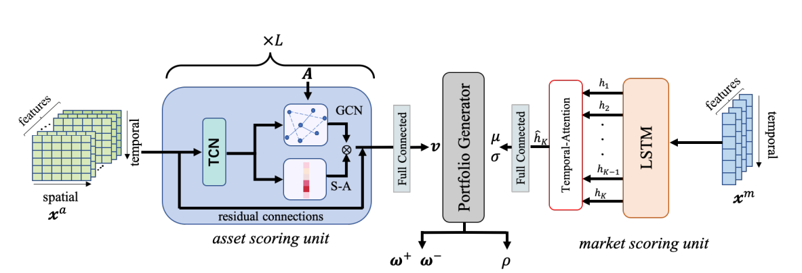

# DeepTrader: paper 6

https://ojs.aaai.org/index.php/AAAI/article/view/16144 

What is long and short positoin
Long
* you buy in the hopes that the prices will go up and sell later at a higher price
* ideal for a bullish market

Short 
* a trader borrows the asset from someone else (usually a broker) and sells it in the market at the current price
* later buys it back from the market and return it the owner i.e broker
* ideal you sell initially at a higher price so that you buy later at a lower price and hence make a profit
* ideal for bear market.

* indicator: our model embeds macro market conditions 
* action: dynamically adjust the proportion between long and short funds,
* reward: negative maximum drawdown as the reward function

other points
* Additionally, the model involves a unit to evaluate individual assets,
* Both temporal and spatial dependencies between assets are captured hierarchically by a specific type of graph structure
* Experiments on three well-known stock indexes demonstrate the superiority of DeepTrader in terms of risk-gain criteria

Our contributions are summarized as follows:
1. We propose DeepTrader, a DRL-based method for riskreturn balanced portfolio management. Market conditions are novelly taken into account as an independent profit-risk balancing module, while the cross-asset interrelationship extraction is enhanced by learning and using a graph structure
to characterize interrelationships between stocks.
2. Experiments on three stock indexes demonstrate the superiority of DeepTrader in balancing risk and return, especially in the period of subprime mortgage crisis and the recovery period. Ablation studies further confirm the effectiveness of the key components in DeepTrader and the effectiveness of using learned causal structure to encode the interrelationships between assets

## Preliminary
* Portfolio management is a sequential decision-making process of allocating resources into a set of financial assets according to current market conditions, aiming to maximize the return while constraining risks
* Trading Procedure: 
    * have 1 risk free asset i.e. cash and volumes of n stocks
    * have a closing price vector, long position and short position
* at the end of episode you sell long positoins and buy short and add cash(not sure) 

model

input:
* stock indicators and market indicators
* The two parts are fed into asset scoring unit and market scoring
unit, respectively
* from the left:
    * stock values are fed
    * it is taken by asset scoring unit, that takes another graph structure A and outputs v
* from the right
    * market values are fed
    * turns it into parameters of the Gaussian distribution: mean µ and standard deviation
* in the middle
    * takes output from the left and right and outputs long, and raw( needs to look up what this this)

Asset Scoring Unit

* 3 main items - TCN (Temporal Convolution Layer), GCN (Graph Convultion), SA (Spatial Attention Mechanism) 
    * SAM: The concept of attention in neural networks was inspired by the idea of selective visual attention in human perception. 
    * Temporal: Similar to traditional convolutional layers used in image analysis (2D convolution), a temporal convolution layer applies a set of learnable filters (kernels) to the input sequence to extract relevant features

Market Scoring Unit
* 
* 
* 
* 

