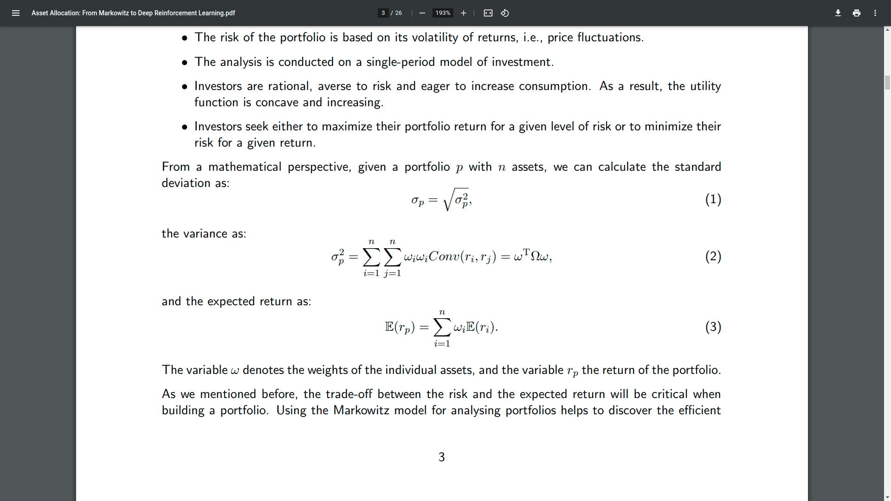
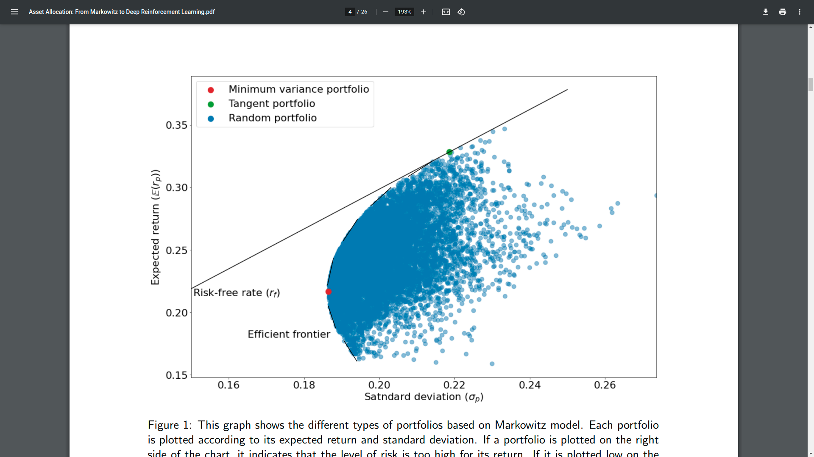
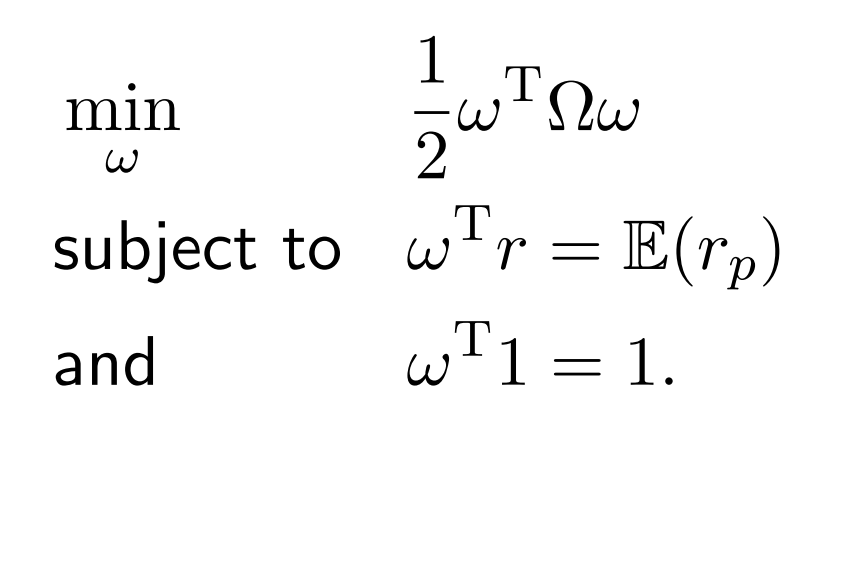
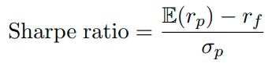
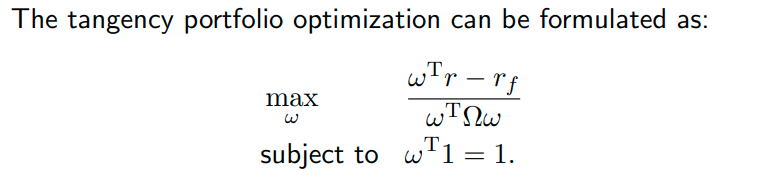
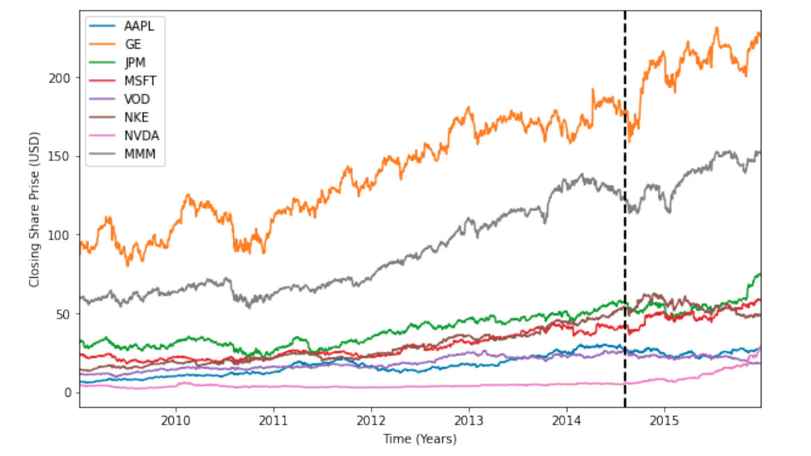
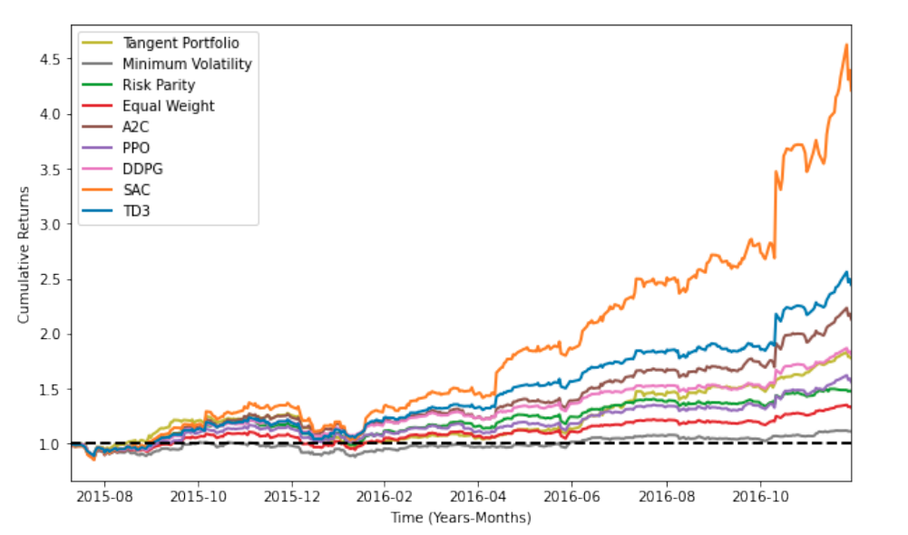
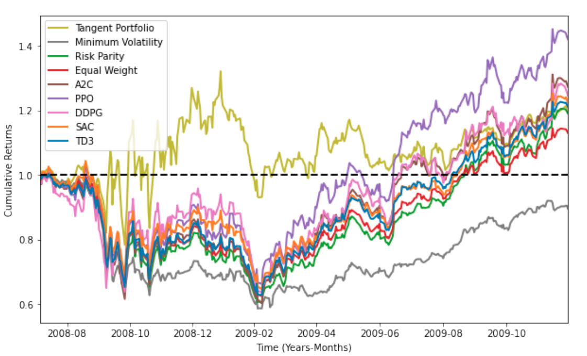
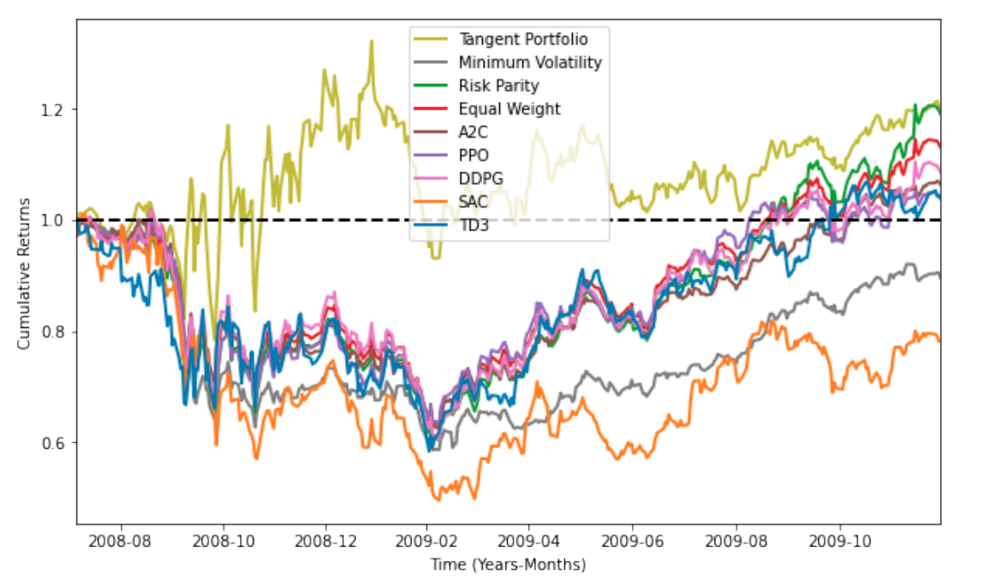

# Asset Allocation: From Markowitz to Deep Reinforcement Learning

Date - 14 July 2022

Code - [here](https://github.com/RicardDurall/Benchmarking-Strategies-for-Asset-Allocation)

Remarks
* seems to be a single author, Fraunhofer Institute for Industrial Mathematics ITWM, phd student setup 

## Introduction
* Asset allocation is an investment strategy that aims to balance risk and reward by constantly redistributing the portfolio’s assets according to certain goals, risk tolerance, and investment horizon 
*  The mean-variance optimization model, proposed by Markowitz (Markowitz, 1968) serves as the keystone to Modern Portfolio Theory (MPT).
* the Sharpe ratio (Sharpe, 1998) is one of its most employed add-ons to measure the
risk-adjusted return with respect to the risk-free asset

## 2 Methodology
### 2.1 Markowitz Mean-Variance Portfolio Theory
* also called as mean-variance optimization approach.
* introduces a financial method, for **risk-averse investors**,to construct diversified portfolios that optimize their returns
* Key assumptions
    * The risk of the portfolio is based on its volatility of returns, i.e., price fluctuations
    * The analysis is conducted on a single-period model of investment.
    * Investors are rational, averse to risk and eager to increase consumption. As a result, the utility function is concave and increasing.
    * Investors seek either to maximize their portfolio return for a given level of risk or to minimize their risk for a given return
* The trade-off between the risk and the expected return will be critical when building a portfolio.
* formuals
* 

* 
* Things on efficient frontier are the best
*  Portfolios that lie below the efficient frontier are suboptimal, as they do not provide enough return for the level of risk.
* Portfolios that cluster to the right of the efficient frontier are also suboptimal because they have a higher level of risk for the defined rate of return. 
* efficient frontier: minimum variance portfolio and tangency portfolio.

### 2.1.1 The Minimum Risk Mean-Variance Portfolio
* The point where the hyperbola (efficient frontier) changes from convex to concave is where the minimum variance portfolio lies.
* 
* The vector ω denotes the individual investments (weights of the assets) subject to the condition that the available capital is fully invested, i.e., $ω^Tr$ = 1. The lower bound on the target return E(rp) is expressed by the condition $ω^Tr$ = E(rp), where the vector r estimates the expected mean of the assets (E(ri)).

### Tangency
The tangency portfolio is the asset allocation that maximizes the Sharpe ratio (Sharpe, 1998)

* Graphically, it is the point where a straight line through the rf is tangent to the efficient frontier, in the Markowitz model space
* 
* 

2.1.3 The Risk Parity Portfolio - focuses on the allocation of the risk instead of the capital.

###  2.2 Deep Reinforcement Learning
* Actor-Critic (AC) - actor (policy) and critic (value based)
* The Advantage Actor-Critic (A2C)
* Deep Deterministic Policy Gradient (DDPG)
    * Namely, DDPG uses a critic that learns from a temporal loss and an actor that learns using policy gradient
    * cons: agent falling into a local optimum or to a catastrophic forgetting.
    * brittle with respect to hyperparameters
* Soft Actor-Critic (SAC) 
* Proximal Policy Optimization (PPO) 

### 2.2.2 Deep Reinforcement Learning for Asset Allocation

* Agent: A deep neural network is proposed as the agent, whose goal is to find an optimal function (either policy- or value-based) that learns actions that maximize the reward.
* Actions: They are the outputs of the network for a given period, and they represent the final portfolio weights, i.e., the percentage of each asset within the portfolio.
* State: It is the input used to feed the network and describes the current situation of the stock market via financial indicators. These indicators are made of a tensor of features, which includes the current
balance of our portfolio, the stock prices, and the owned assets.
* Environment: The stock market acts as the environment. It receives the actions taken by the agent and sends back the reward to the agent.
* Reward: The difference between the previous and the current portfolio values is our reward (differential returns).
* few assumptions for a correct interpretability
    * It is possible to trade at the market any time
    * Our transactions do not to affect the market price of the assets

## 3 Experiments
Given a portfolio with a set of n assets, we aim
to benchmark several allocation optimization methods, including traditional and DRL ones

## 3.1 Experimental Settings
* In particular, we study bull and bear market scenarios, on a day-trading setup.
* closing price might not be a true indicator of true value 
*  the closing price is adjusted considering factors such as dividends, stock splits, and
new stock issues giving the adjusted close price.
* **In all our experiments, we use adjusted close price as input.**
* For each market scenario, we select **a set of 8 stocks**, from well-known companies, that follow the market tendency that we target to study. 
* We use data from a period of seven years
* 80:20 train test split
* **We evaluate the performance of 9 different algorithms: tangency portfolio, minimum variance portfolio,risk parity, equal weight, A2C, PPO, DDPG, SAC and TD3**

### 3.2 Bull Market Scenario 
* good market time (Propelled by the thriving economies and low unemployment rate, investors are eager to buy or hold onto securities)
* Bull market occurs when investment prices rise for a sustained period of time
* The result is a buyer’s market. Bull markets tend to last for months or even years. Famous bull markets were the 1970s economic recovery as well as the pre-global financial crisis bull market.
* Our first case of study focuses on 8 stocks that follow a bullish trend
* 
* The vertical dashed line separates the training data (left)
from the testing data (right).
* Best output in 10 runs
* 
* Worst output in 10 runs
* 

### 3.3 Bear Market Scenario
* bad time in market
* Bear market occurs when stock prices fall 20% or more for a sustained period of time.
* Triggered by periods of economic slowdown and higher unemployment rate, investors are reluctant to buy, often fleeing for the safety of cash or fixed-income securities
* The result is a seller’s market.
* The first and most famous bear market was the great depression.The dot com bubble in 2000 and the housing crisis of 2007–2008 are other examples
* Our second case of study focuses on 8 stocks that follow a bearish trend.
* Best output in 10 runs
* 
* Worst output in 10 runs
* 

## 3.4 Conclusions
* Traditional approaches, based on Markowitz portfolio, do not require any fitting optimization process (training) since they do not employ learnable parameters. In our experiments, these models show stable results, achieving competitive performance on both market scenarios.
* Among them, tangency portfolio stands out as this method almost always provides the highest annual and cumulative returns as well as the best Sharpe and Calmar ratios
* But traditional approaches are all sensitive to outliers and abrupt market’s changes.
* DRL hard to interpret
* PPO and SAC achieve overall the best results in both bullish and bearish markets, respectively, nonetheless, none of them can even beat the equal weight strategy when having poor runs 
* 
* 
* 
* 

