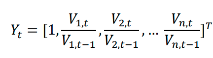
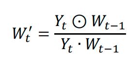
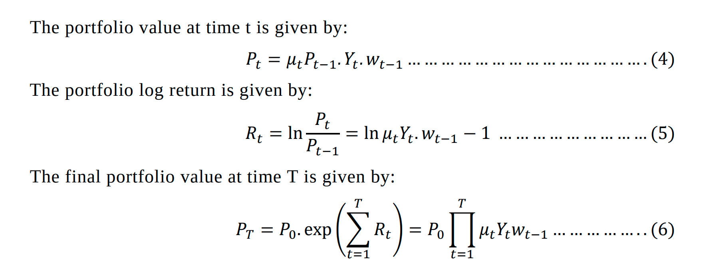

# paper 3

The use of Deep Reinforcement Learning in Tactical Asset
Allocation
Code : https://github.com/Musonda2day/Asset-Portfolio-Management-usingDeep-Reinforcement-Learning-

## 1. Introduction

* The major challenge is forecasting expected returns
* estimation error causes optimized strategies to be outperformed by naïve strategies (equaly weightage)
* Another challenge is with the transaction costs associated with
the frequent rebalancing of a portfolio
* Statement : The TAA problem is a problem to accurately capture short to medium term market trends and anomalies in order to allocate the assets in a portfolio so as to optimize its performance by increasing the risk adjusted returns. 
* what we do: Three DRL models are explored and we have proposed the use of the Advantage Actor Cretic (A2C) Model because it is stable, cost effective, faster and works better with large batch sizes

## 2. Problem Description
* initial capital investment which is invested in a set of assets
* initial : equal weight allocation
* all of the capital is invested
*  consider a portfolio of 𝑛𝑛 number of assets with a vector of close prices at time
𝑡𝑡 given by $V_t$
* Normalise V_t by dividing each asset with the previous closing price
* Portfolio vector is the weightage of total wealth invested in the ith asset
* portfolio vector at time 𝑡𝑡 is determined by the element-wise product of the normalized price vector and the weights at time 𝑡𝑡 − 1 divide by their dot product
* 
* 
* transaction costs is there so if you sell at that price we wont get that much only fraction we get so $\mu \in$ [0,1] 
* $P_t$ =$\mu . P'_t$ where $\mu$ ∈ [0,1]
* 
* eq 4 :
    * $\mu$ is transaction cost  that is there always 
    * P_{t-1} : is price vector of unit asset 
    * w_{t-1} : ?? 

## Reinforcement Learning Configuration
* state : High, Low, Close, the covariance matrix of close
prices and the identified market financial indicators that are used as inputs
* The action (𝐴𝐴) is the desired weights allocation. $A_{t}=W_{t}$
* pls read through
* 
* 

## 3. Literature Review
* The optimization problem of TAA can be presented as a Markov Decision Process (MDP) which can be solved using Dynamic Programming (DP) (Neuneier, R., 1996)

The following technical indicators are generated to be used as feature:
1. Volatility Average True Range (ATR)
2. Volatility Bollinger Band Width (BBW)
3. Volume On-balance Volume (OBV
4. Volume Chaikin Money Flow (CMF)
5. Trend Moving Average Convergence Divergence (MACD)
6. Trend Average Directional Index (ADX)
7. Trend Fast Simple Moving Average (SMA)
8. Trend Fast Exponential Moving Average (EMA)
9. Trend Commodity Channel Index (CCI)
10. Momentum Relative Strength Index (RSI)

Not completed
* 
* 
* 
