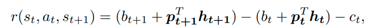

# paper 5 

Deep Reinforcement Learning for Automated
Stock Trading: An Ensemble Strategy

## I. INTRODUCTION

Existing works are not satisfactory. Why ??

What is the traditional approach
* the expected stock return and the covariance matrix of stock
prices are computed.
* The best portfolio allocation
strategy can be obtained by either maximizing the return for
a given risk ratio or minimizing the risk for a pre-specified
return

What is the problem with this
* transaction cost not accounted often
* the portfolio managers may want to revise the decisions at each time step, 

Dynamic Progamming, why not ?
* the scalability of this model is limited due to the large state spaces when dealing with the stock market.

Game Plan
* First, we build an environment and define
action space, state space, and reward function.
* Second, we train the three algorithms that take actions in the environment. 
* Third, we ensemble the three agents together using
the Sharpe ratio that measures the risk-adjusted return. 
* The effectiveness of the ensemble strategy is verified by its
higher Sharpe ratio than both the min-variance portfolio
allocation strategy and the Dow Jones Industrial Average 1
(DJIA).

## II. RELATED WORKS
* ususally only method approaches
* Learning models with continuous action space provide finer control capabilities than those with discrete action space

## III. PROBLEM DESCRIPTION

A. MDP Model for Stock Trading
* State s = [p, h, b]
    * stock prices p 
    * the stock shares h
    * remaining balance b 
* Action a : a vector of actions over D stocks
    * allowed actions on each stock include selling, buying, 
    or holding, which result in decreasing, increasing, and
    no change of the stock shares h
* Reward r(s, a, s'): the direct reward of taking action
a at state s and arriving at the new state s'

B. Incorporating Stock Trading Constraints
* Market liquidity
* Nonnegative balance b ≥ 0: the allowed actions should
not result in a negative balance
* Transaction cost: transaction costs are incurred for
each trade
* Risk-aversion for market crash

C. Return Maximization as Trading Goal
* reward function as the change of the portfolio value when action a is taken at state s and arriving at new state s
0
* The goal is to design a trading strategy that maximizes the change of the portfolio value:
* 
* 
* 
* 

