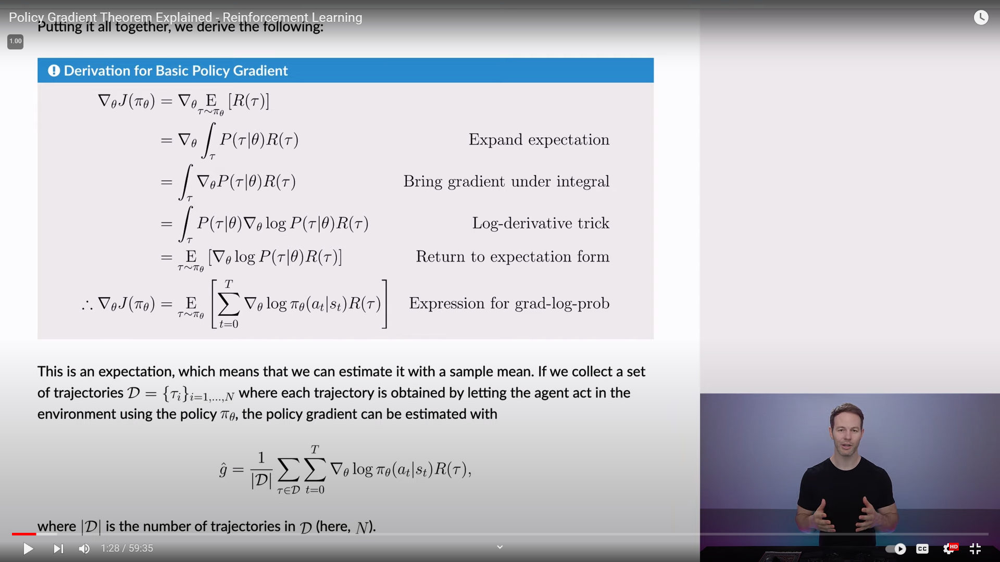
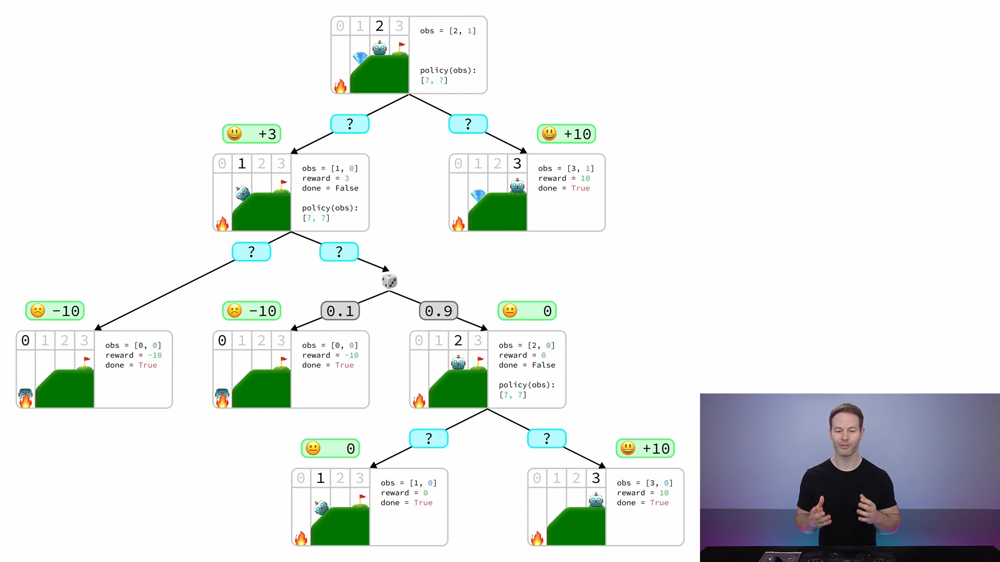
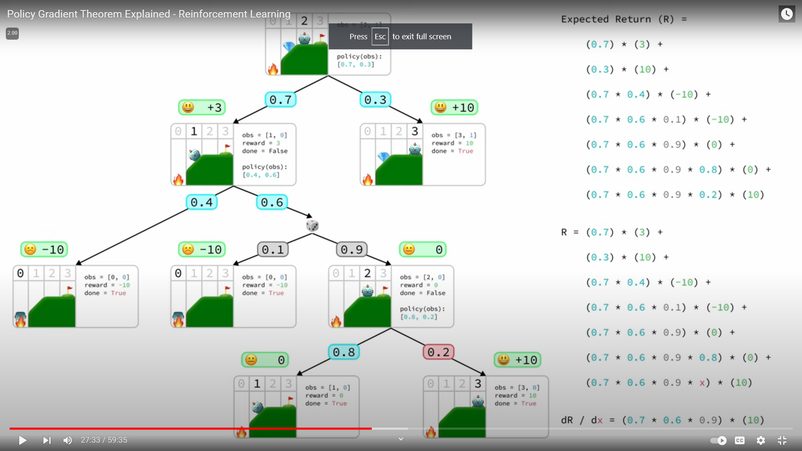
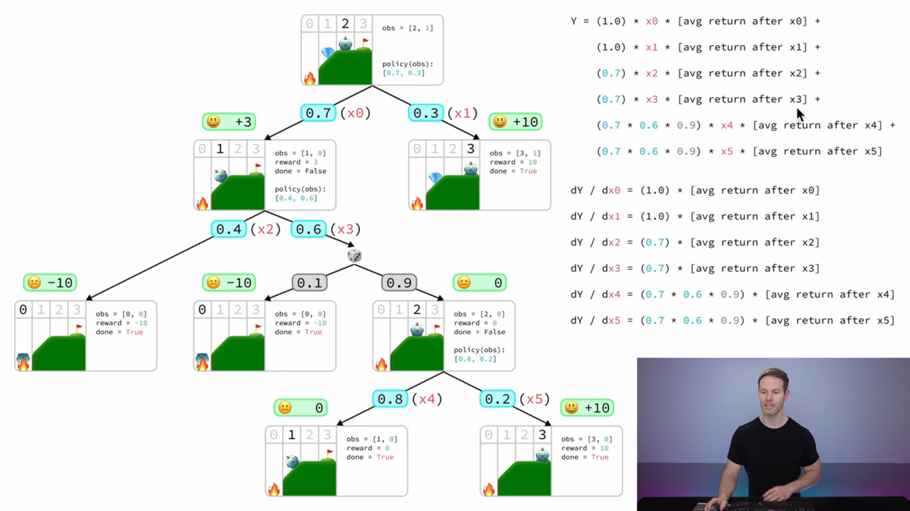

# Note - 2 : Replacement Mathematical foundations

## key understandings from Note
* basically instead of maxxing it, we replace it with policy net target
* we can investigate more into why it works mathematically. or 
* think how we can include them in boaker paper
* lets do the former now

## Attempt 0 (chatgpt)
* 
* 
* 
* 

## Attempt 1 (From paper DDPG)
* in one note 
* not much proof is there. it converts from DPG to DDPG so not sure if this is the paper to go to.
* So lets learn about DPG 

## DPG Attempt 0
* [ref](https://medium.com/geekculture/introduction-to-deterministic-policy-gradient-dpg-e7229d5248e2)
* our goal is to maximize a performance measure function $J(θ) = E[r_γ |π]$, which is the expected total discounted reward following policy π, where θ is the parameters of the function we are updating
* **Here is an expanded version of the performance measure function where we sum up all rewards over the state distribution ρ and actions in each state.**
* 
* Unlike a stochastic policy, we define our policy to be the function μ_θ: S → A
* we only need to sum over the state space as action is deterministic
* 
* For the deterministic policy, we will be doing something similar. Since our action space is continuous, we will move our policy in the direction of the Q function’s gradient. Instead of maximizing Q by taking the argmax action, the policy will converge towards a maxima Q value.
* 
* 
* 
* This seems to be a good road to go down to ... lets explore more
* 
* 

***
Day 2 
* what we have
* 
* policy iteration
* After learning a policy evaluation function Q, we build a policy using argmax to select the action with the highest Q value
* Since our action space is continuous,
*  we will move our policy in the direction of the Q function’s gradient. Instead of maximizing Q by taking the argmax action, **the policy will converge towards a maxima Q value**. We can write this gradient as an expectation:
* 
* chain rule
* 
* 
* **The proof for this deterministic policy gradient is similar in structure to the proof for the policy gradient theorem detailed in (Sutton et al. 1999)**
* *The paper introduces a theorem that shows that the deterministic policy gradient is really just a special case of the stochastic policy gradient*
* **policy gradient theorem**
    * 
    * We can parameterize the policy function π with the deterministic policy μ_θ and variance σ, similar to that of a policy parameterization for continuous actions.
    * **The theorem states that as σ approaches 0, π = μ.**
    * 
    * *The proof for this theorem can be found in Appendix C of the paper*
    * *This theorem is important as it shows that other techniques such as compatible function approximation, natural policy gradients, and experience replay can be applied to deterministic policy gradients.*
    * I think i feel i should understand this more

<!-- ## Policy Gradient Theorem
* [youtube](https://www.youtube.com/watch?v=cQfOQcpYRzE) 
*  
* lets look at a game
*  
* policy gradients give us an indication of how good taking that action is 
* we just need to find gradient 
* even though we dont have Expected value of returns we can do 
* dR/daction1 
*  
* dr/dx turns out to be : ( $\pi$ probabilities of reaching there  ) * (expected return after taking that action)
*  
* we can find avg returns just by sampling from the environment
* not much idea why i went here -->

<!-- ## back to last attempt -->

* we have an Actor that updates the policy
* and a Critic, which will approximate the true action-state function Q by learning a set of parameters
* 