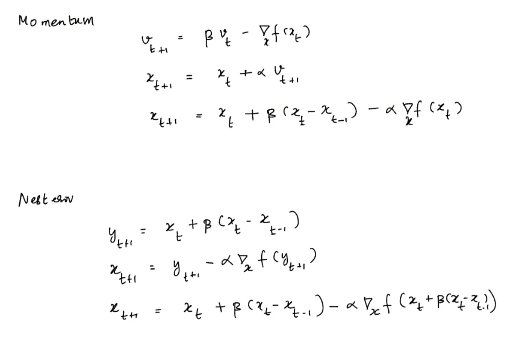

# Lecture 1 

- video
- actor critic
- see paper again

stochastic grad descent:
- instead of doing gradient on the entire dataset
- do it on a batch << n

* [krish naik](https://www.youtube.com/watch?v=FpDsDn-fBKA)

* since we r taking mini batches the gradient will be approx = (actual + noise) 
* 
* 
* 

example
two points
f(x) = w1x1 + w2.x2 

loss = $\frac{1}{m}\sum_{i=1}^{i=m} (y- \hat{y})^2$
* or have 1/n in the grad instead of the loss 
df/dw1 = x1
df/dw2 = x2

* every time i get pushed around in the circle of radius $\alpha$
* the alpha decreases as time goes on $ \alpha_t \rightarrow 0$ 
* expected value of noise is 0
* we want summablitiy to inifinity aas we dont know when we will reach the destinatino
*  analogy : drunkard person walking
*  
*  

momentum and other methods from 32:00

im getting a feeling post this not much useful ... 28ish

