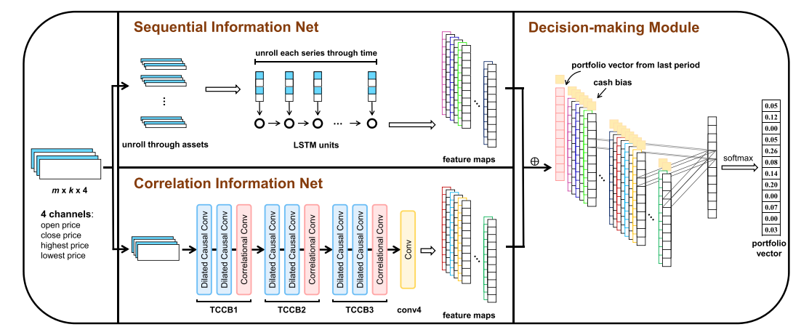

# Daily Task updates 

## March 21 : 
* aim: create 2 agents and method to compare everything and metrics
* Scouting Risk sensitive methods [click here for .md](./risk_sensitive_metrics.md)

### Ideas/Insights

Idea 1 
* Tag: **MODEL ARCHITECTURE**
* [ref](https://ieeexplore.ieee.org/stamp/stamp.jsp?tp=&arnumber=9031418)
* 
* In practice, both the price sequential pattern and the asset
correlation are significant for the decision-making in portfolio selection tasks. Specifically, the price sequential pattern
reflects the price changes of each asset; while the asset correlation reveals the macro market trend and the relationship
among assets. Therefore, it is necessary to capture both
types of information in the learning process

Insight 2 
* [ref](https://link.springer.com/article/10.1007/s10479-018-3112-8)
* 
* 
* 

