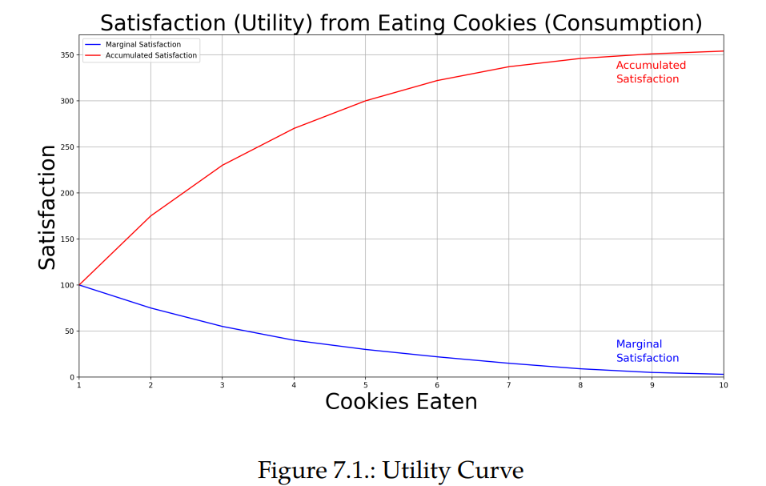

# Chapter 7

## Financial Utility

### Introduction
* Utility Theory is a vast and important topic in Economics
* Utility (in Economics) refers to the abstract concept of an individual’s preferences over choices of products/services/activities

Let’s say you are offered 3 options to spend your Saturday afternoon:
1. lie down on your couch and listen to music, 
1. baby-sit your neighbor’s kid and earn some money or 
1. play a game of tennis with your friend

* Utility Theory aims to formalize making choices by assigning a real number to each presented choice 
* the number is just a ref for its value and need not be anything concrete
* for instance in our example this number need not be the dollars transacted but just a number to signify the happiness.

### A Simple Financial Example
* setting: Let’s say you will be paid \$1000 if the coin shows HEAD on the toss, and let’s say you would be required to pay \$500 if the coin shows TAIL on the toss.
* Now the question is: How much would you be willing to pay upfront to play this game? 
    * 1st ans: 250 cause thats the estimated value: 250 = 0.5(1000) + 0.5(−500)
    * 2nd ans: less than 250 cause i am taking a risk so i need to be compensated for that. 
* What is risk ? 
    * It refers to the degree of variation in the outcomes (\$1000 versus -\$500)
* Why the need for compensating for a risk?
    * conjecture: If −\$500 makes you unhappy, \$1000 should make you happy, and so, shouldn’t we average out the happiness to the tune of $250?
    * Not quite so 
    * satisfaction/happiness - notion of utility of outcomes 
    * if he wins he gets 1000, so profit = 750, let this give 100 units of happiness
    * if he looses he gets -500, so profit = -750, let this give -100 units of happiness
    * if on losing also that gave -100 units then 250 is justified but more often than not on losing you will have -120 units of happiness
    * so we need to make sure that the happiness levels are symmetric
    * therefore you put in less money upfront for taking the risk
    * hence compensating for a risk
    * Happiness parameter is fairly individualised  
* Individualized demand of “compensation for risk” as the attitude of **RiskAversion**
* The amount of compensation they seek is called **Risk-Premium**
* The more Risk-Averse an individual is, the more Risk-Premium the individual seeks.
* “asymmetry of utility" is the root cause

## 7.3. The Shape of the Utility function
* Utility is a **non-linear** function of financial outcomes
###  Utility of Consumption
Example of a cookie 

Marginal
* lower curve as the marginal satisfaction (utility) curve
*  Marginal Utility refers to the incremental satisfaction we gain from an additional unit of consumption
* From marginal satisfaction curve: the first cookie gives us 100 units of satisfaction (i.e., utility)
* second provides 80 units, 5th 30 units
* **marginal utility function is a decreasing function**

Accumulated
* upper curve as the accumulated satisfaction (utility) curve
* Accumulated Utility refers to the aggregate satisfaction obtained from a certain number of units of consumption 
* accumulated utility function is the Utility of Consumption function
* Denote the number of cookies eaten as x, and so the total “satisfaction” (utility) after eating x cookies is referred to as U(x).
* **concave function**

In finance
* say there is a chance of winning 1 M if that gives you 1000 units 
* winning 1 B wont give 1000 x 1000 but instead only 10,000
* hence Utility of financial gains is a fairly concave function

## 7.4. Calculating the Risk-Premium
* concavity $\rightarrow E[U(x)] < U(E[x])$
* Certainty-Equivalent Value $x_{CE}$
* $x_{C E}=U^{-1}(\mathbb{E}[U(x)])$
* Certainty-Equivalent Value represents the certain amount we’d pay to consume an uncertain outcome. 
* 

*  Absolute Risk-Premium $\pi_A$ :
$$
\pi_A=\mathbb{E}[x]-x_{C E}
$$
*  Relative Risk-Premium $\pi_R$ :
$$
\pi_R=\frac{\pi_A}{\mathbb{E}[x]}=\frac{\mathbb{E}[x]-x_{C E}}{\mathbb{E}[x]}=1-\frac{x_{C E}}{\mathbb{E}[x]}
$$
* From this point **intenese maths** is happening pls refer
* abs risk aversion, rel risk aversion 
* R(x) is Relative Risk Aversion
* $\pi_R \approx \frac{1}{2} \cdot R(\bar{x}) \cdot \sigma_{\frac{x}{\bar{x}}}^2$
* Absolute Risk-Aversion is A(x)
* all of these have multiple formulas pls look up pg 202

Conclusion
* typical optimization problems in financial applications, we maximize $E[U(x)]$ (not E[x]), which in turn amounts to maximization of $x_{CE} = E[x] − π_A.$
* Note when Linear Utility function U(x) = a + bx implies Risk-Neutrality (i.e., when one doesn’t demand any compensation for taking risk)
* but linear  un is non linear as stated above

typically-used Utility functions U(·) with:
• Constant Absolute Risk-Aversion (CARA)
• Constant Relative Risk-Aversion (CRRA)

## 7.5. Constant Absolute Risk-Aversion (CARA)
* Consider one specific form of utility function such that its Absolute Risk-Aversion is always constant a 
* What does a signify
    * positive a signifies the degree of risk-aversion
    * zero : risk neutral
    * negative values: risk seeking
* some more maths pls refer

## 7.6. A Portfolio Application of CARA
* we put $\pi$ fraction into risky asset and remaining into non risky assets
* we can get an optimal fraction to invest in a risky asset

## 7.7. Constant Relative Risk-Aversion (CRRA)
* do the same aove mentioned stuffs again 
* 

