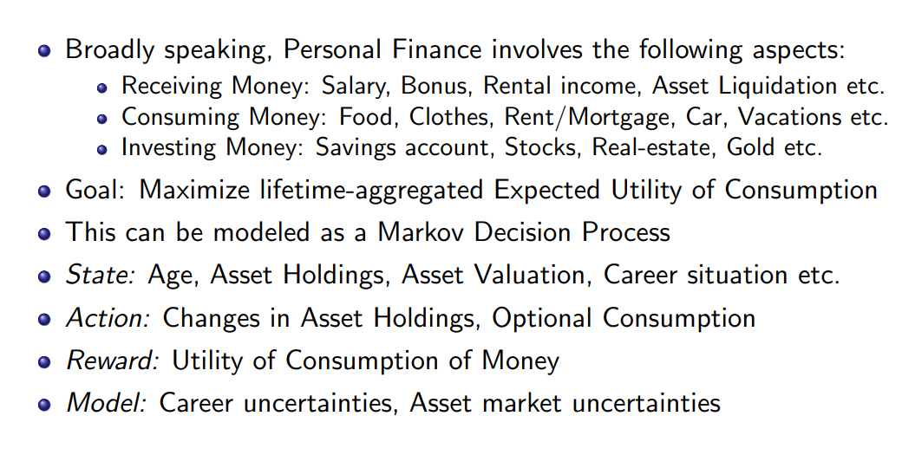

# Title: A Guided Tour of Chapter 6 - Dynamic Asset-Allocation and Consumption

I think its chapter 8 in the book
sources
* the first application  problem
* https://web.stanford.edu/class/cme241/lecture_slides/Tour-AssetAlloc.pdf

Title: A Guided Tour of Chapter 6 - Dynamic Asset-Allocation and Consumption
* actually slides are too good you need to go though them

## Introduction

* The two considerations are:
    1. How to allocate money across assets in one’s investment portfolio
    1. How much to consume for one’s needs/operations/pleasures
* Asset-Allocation and Consumption decisions at each time step
* Asset-Allocation decisions typically deal with Risk-Reward tradeoffs
* Consumption decisions are about spending now or later
* Objective: Horizon-Aggregated Expected Utility of Consumption 

## Resources

Paper Codes
* Deep Reinforcement Learning for Automated Stock Trading: An Ensemble Strategy (on FInrl) 
    1. https://towardsdatascience.com/deep-reinforcement-learning-for-automated-stock-trading-f1dad0126a02
        * A2C, DDPG, PPO
    1. https://github.com/AI4Finance-Foundation/FinRL-Live-Trading
    1. https://github.com/AI4Finance-Foundation/FinRL
* paper September 21 2022 : Model-Free Reinforcement Learning for Asset Allocation - https://arxiv.org/abs/2209.10458
    * JP Morgan and African University

Other Codes
* JP Morgan Chase Class Project Github - [github](https://github.com/selimamrouni/Deep-Portfolio-Management-Reinforcement-Learning)
* work in progress Github - [github](https://github.com/Musonda2day/Asset-Portfolio-Management-usingDeep-Reinforcement-Learning-)
* Kaggle - https://www.kaggle.com/code/lekynam2000/deeprl-td3

report - 
* portfolio optimisation 
* 
* 
* 

