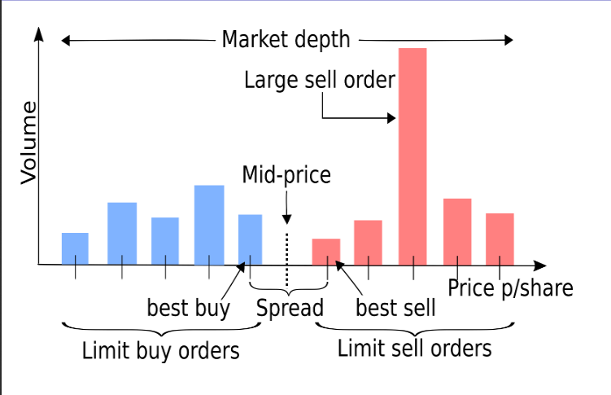

# Problem 4 : Optimal Trade Order Execution

## Trading Order Book
The order book shows how many limit orders are active at each price level at the current moment. It is used to review the current market depth and estimate the the filled price of a market order.

</img>

p_0(b) is best bid, p_0(a) is best ask.

best bid = largest price bid
best ask = smallest price ask

mid  = avg(best bid + best ask)
spread = best ask - best bid
market depth = largest ask value - smallest bid value

Buy LO(P,N) , willingness to buy N shares at price <= P
Sell LO(P,N), willingness to sell N shares at price >= P

## Optimal Trade Order Execution Problem

