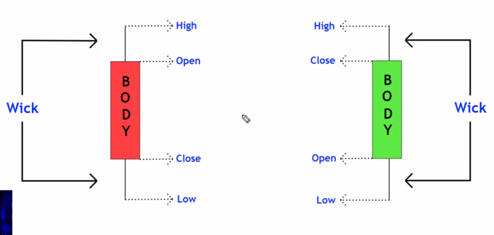

# finance technical analysis

## candlestick chart

* each rectangle summarises what happened during that time period (5 mins or 1hr or something)
* green: price closed > price opened
* red: price closed < price opened

## Trend of Market
* up trend : more 
* 
* 
