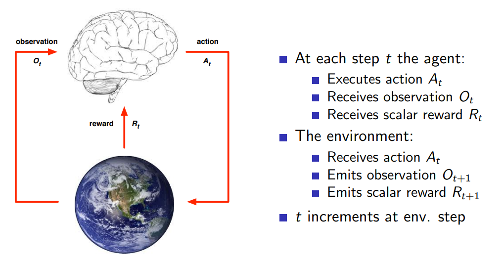

# Lecture 1

## Links
* [video](https://www.davidsilver.uk/wp-content/uploads/2020/03/intro_RL.pdf)
* [slides](https://www.davidsilver.uk/wp-content/uploads/2020/03/intro_RL.pdf)

* [An Introduction to Reinforcement Learning, Sutton and Barto, 1998](https://web.stanford.edu/class/psych209/Readings/SuttonBartoIPRLBook2ndEd.pdf)

* [Algorithms for Reinforcement Learning, Szepesvari](http://www.ualberta.ca/∼szepesva/papers/RLAlgsInMDPs.pdf)
    * more concise

## Introduction

What makes reinforcement learning different from other machine
learning paradigms?
* There is no supervisor, only a reward signal
* Feedback is delayed, not instantaneous
* Time really matters (sequential, non i.i.d data)
* Agent’s actions affect the subsequent data it receives

Main takeaway: no one (supervisor) tells which is the best decision at a time , you just try out some stuff and get some rewards and after some time you figure it out.

## Rewards
* The agent’s job is to maximise cumulative reward
* A reward $R_t$ is a scalar feedback signal, it indicates how well agent is doing at step t
* **Goal: select actions to maximise total future reward**
* Actions may have long term consequences
* reward is delayed
* It may be better to sacrifice immediate reward to gain more
long-term reward

## Agent and Env

* we can control the environment only through actions

## History and state
* The history is the sequence of observations, actions, rewards
* As far as the agent is concerned what happens next depends on the history
* state is like a concise summary of the history
* $S_t = f(H_t)$

### Environment State 
* state of the environment
* private to env, the agent might not be able to see it

### Agent state
* agent's internal state
* whatever information the agent uses to pick the next action
* It can be any function of history

### Information State
* An information state (a.k.a. Markov state) contains all useful information from the history.
* A state $S_t$ is Markov if and only if 
$\mathbb{P}\left[S_{t+1} \mid S_t\right]=\mathbb{P}\left[S_{t+1} \mid S_1, \ldots, S_t\right]$
* **The future is independent of the past given the present**
* the past doesnt give us anymore information than what the present gives us, hence we can ignore it.
* *The state is a sufficient statistic of the future*

## Env
* Fully observable environment
    * Markov Decision Process (MDP)    
* partially observable environment
* agent state != env state
* agent state

## Inside RL agent

* 3 major components of an agent
    * Policy: state to what action to take 
    * Value function: how good is an action/state or what is the expected reward of doing something 
    * Model: Agent's view of the environment.

### Policy
* Deterministic policy: action = function(state)
* Stochastic policy: $\pi$(a|s) = P[$A_t$ = a|$S_t$ = s]

### Value
* Value function is a prediction of future reward
* Used to evaluate the goodness/badness of states And therefore to select between actions
* $v_π(s) = E [R_{t+1} + γR_{t+2} + γ^2 R_{t+3} + ... |  S_t = s$]
* this is like given one state what is the expected cummulative rewards that we can get.
* state value vs action value
    * state value: Following a policy p the state-value-function returns the value, i.e. the expected return for selecting a certain state s. Return means the overall reward.
    * action value: Following a policy p the action-value-function returns the value, i.e. the expected return for using action a in a certain state s. Return means the overall reward. 
* we can think risk is already accounted for in this

### Model
* 
* 
* 
* 
* 
* 
* 
* 
* 
* 
* 
* 

