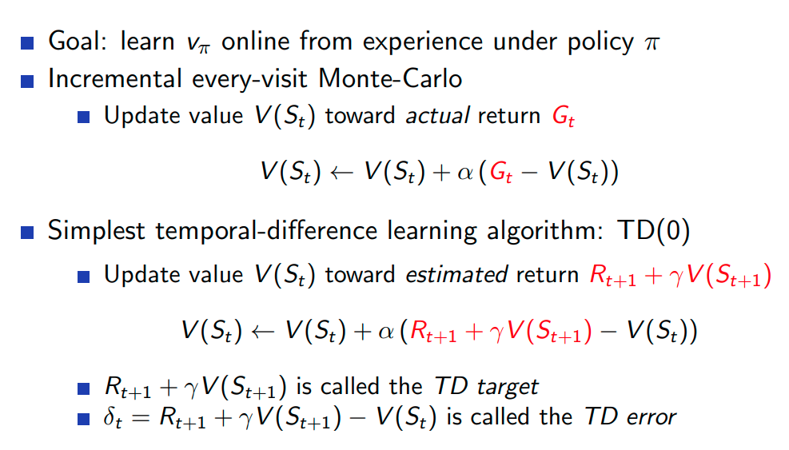
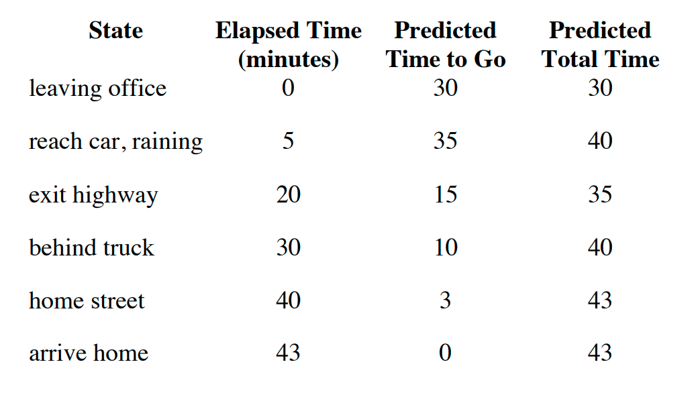
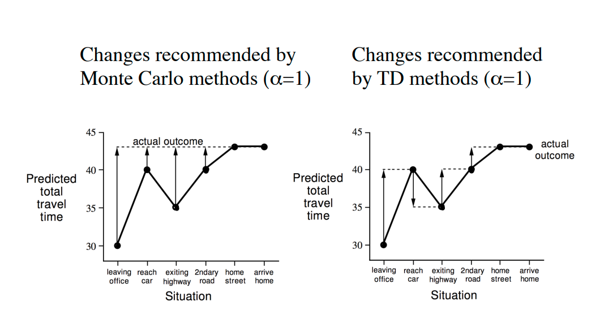
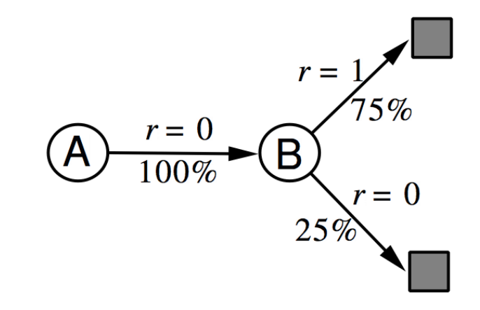
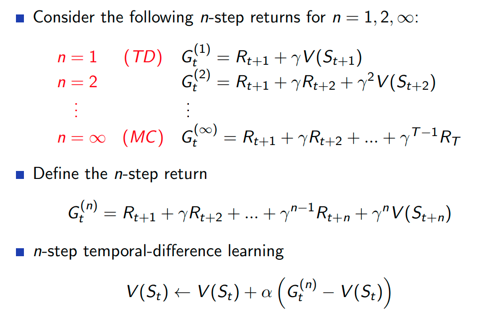

# Lecture 4

## links
* [slides](https://www.davidsilver.uk/wp-content/uploads/2020/03/MC-TD.pdf)
* [videos](https://www.youtube.com/watch?v=PnHCvfgC_ZA&list=PLqYmG7hTraZBiG_XpjnPrSNw-1XQaM_gB&index=6)

## Model free prediction
* estimate value of an unknow MDP
* last class : solve a known MDP
* next class : optimise an unknown MDP

## Monte Carlo 
* learn from episodes of experience
* look at sample returns and average over it
* this only works for terminating episodes. (no infinite epsiodes)
* episodes as : S,A,R,S,A,R,S,A,R.....S,A,R
* return : total discounted reward
* value : expected return
* MC : does empirical mean return instead of expected return

### First Visit Monte Carlo Policy Evaluation
* we evaluate state s in the first time we enter it.

### Every-Visit Monte-Carlo Policy Evaluation
* every time step t that s is visited in an episode

### Black Jack
* get close to 21 without going over 21 and beat the dealer if your total is more than your dealer

<!-- ## Concepts -->
### Incremental Mean
* you can calculate mean on the go

* you can think of this as **new_value= old_value + factor.(error)** 

### Incremental Monte Carlo Updates
* increment states like above new_value= old_value + factor.(error)
* also sometimes we want to forget older stuff and remember new er stuff
* 

## Temporal Difference Learning
* learn from incomplete epsidoes, by bootstrapping the remainder(guess) 
* TD updates a guess towards a guess
* Values are estimated returns
* 
* TD target and error

### Example : car driving 
* you see car coming towards you and you feel like you will crash but in the last moment you pull out and survive 
* In MC we cant put negative rewards, or like you need to die in order to update the value function
* In TD you can do that dynamically
* 
* 

## TD vs MC
* Advantages
    * TD can learn before knowing the final outcome
    * TD can learn without the final outcome
    * TD for non terminating episodes
* bias and variance
    * TD has lower variance but some bias
    * MC has higher variance but no bias
* **slowly things are getting out of hand if I am being honest**
* TD seems to be better than monte carlo 
* Both TD and MC converge.
* Disadv:
    * stackexchange: The main problem with TD learning and DP is that their step updates are biased on the initial conditions of the learning parameters. 

## Concrete Example

Two states A, B; no discounting; 8 episodes of experience
A, 0, B, 0
B, 1
B, 1
B, 1
B, 1
B, 1
B, 1
B, 0
What is V(A), V(B)?
* Monte Carlo
    * V(B) = total_return / total_episodes = 6/8=0.75
    * V(A) = 0/1 = 0
* TD
    * 
    * V(B) =  
    * V(A) = 
* **didn't understand the above example**.

Bootstrap 
* MC does not bootstrap while TD does

Backup
* how far along the tree branch will you go to see the actual result
* MC full backup, TD shallow backup
* 

We can do TD-$\lambda$ to pick something from sallow to deep backup along the lower horizontal axis in the figure

Q: why do we assume the value after 1 step will be better than current value
* the other way we get the wrong ans

## $TD -\lambda$
* we did 1 step then estimate, why not
* do 2 step then estimate, why not
* do n step then estimate, why not
* eventually ($\infin$) you will reach all the steps which is monte carlo
* TD0: 1 step version
* 

Which n is better?
* it depends
* another method to do is return avg(return_n=2 +return_n=6 + ...)
* Can we do avg return of all n returns ?? YES its called $TD(\lanbda)$
* 1:27
* 
* 
* 

## Asignment
* https://www.davidsilver.uk/wp-content/uploads/2020/03/Easy21-Johannes.pdf

## Major takeaways
* montae carlo
    * we have to wait till the end of the episode, because update happens on the actual return which is estimated at the end of the episode
* Temporal leanrning
    * we can make changes after each situation , coz we just use estimated return which can be computed after each step
* 
* 
* 
* 
* 

