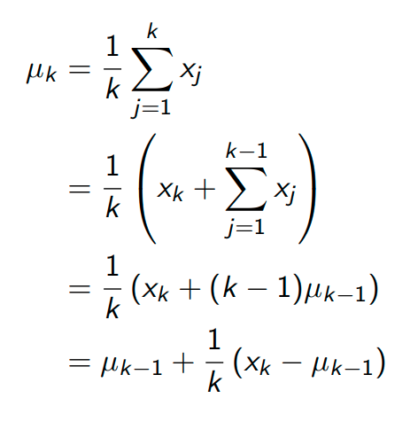

# Lecture 4

## links
* [slides](https://www.davidsilver.uk/wp-content/uploads/2020/03/MC-TD.pdf)
* [videos](https://www.youtube.com/watch?v=PnHCvfgC_ZA&list=PLqYmG7hTraZBiG_XpjnPrSNw-1XQaM_gB&index=6)

## Model free prediction
* estimate value of an unknow MDP
* last class : solve a known MDP
* next class : optimise an unknown MDP

## Monte Carlo 
* learn from episodes of experience
* look at sample returns and average over it
* this only works for terminating episodes. (no infinite epsiodes)
* episodes as : S,A,R,S,A,R,S,A,R.....S,A,R
* return : total discounted reward
* value : expected return
* MC : does empirical mean return instead of expected return

### First Visit Monte Carlo Policy Evaluation
* we evaluate state s in the first time we enter it.

### Every-Visit Monte-Carlo Policy Evaluation
* every time step t that s is visited in an episode

### Black Jack
* get close to 21 without going over 21 and beat the dealer if your total is more than your dealer

<!-- ## Concepts -->
### Incremental Mean
* you can calculate mean on the go

* you can think of this as **new_value= old_value + factor.(error)** 

### Incremental Monte Carlo Updates
* increment states like above new_value= old_value + factor.(error)
* also sometimes we want to forget older stuff and remember new er stuff
* 

## Temporal Difference Learning
* 35 02
* 
* 
* 
* 
* 
* 
* 

## Asignment
* https://www.davidsilver.uk/wp-content/uploads/2020/03/Easy21-Johannes.pdf

## Major takeaways
* montae carlo
    * we 
* Temporal leanrning

