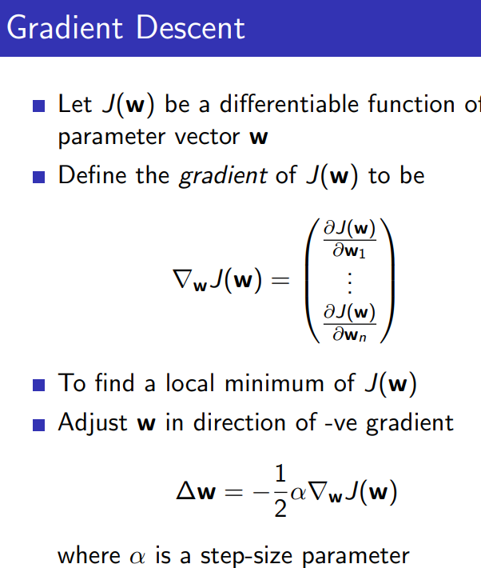
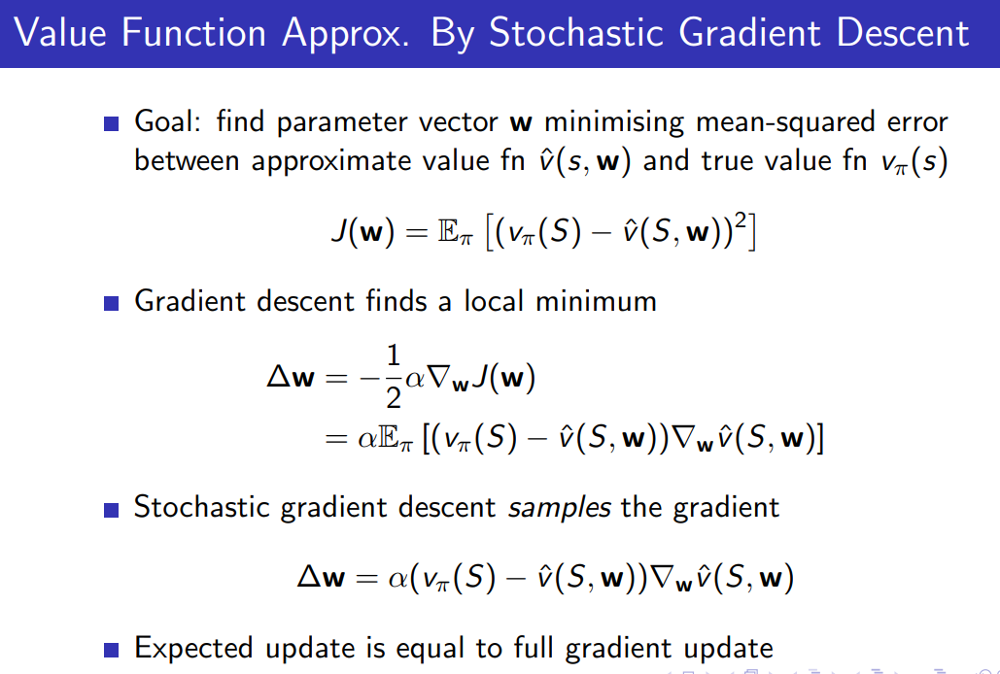
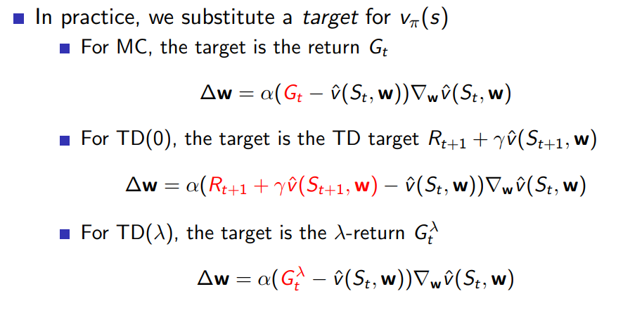
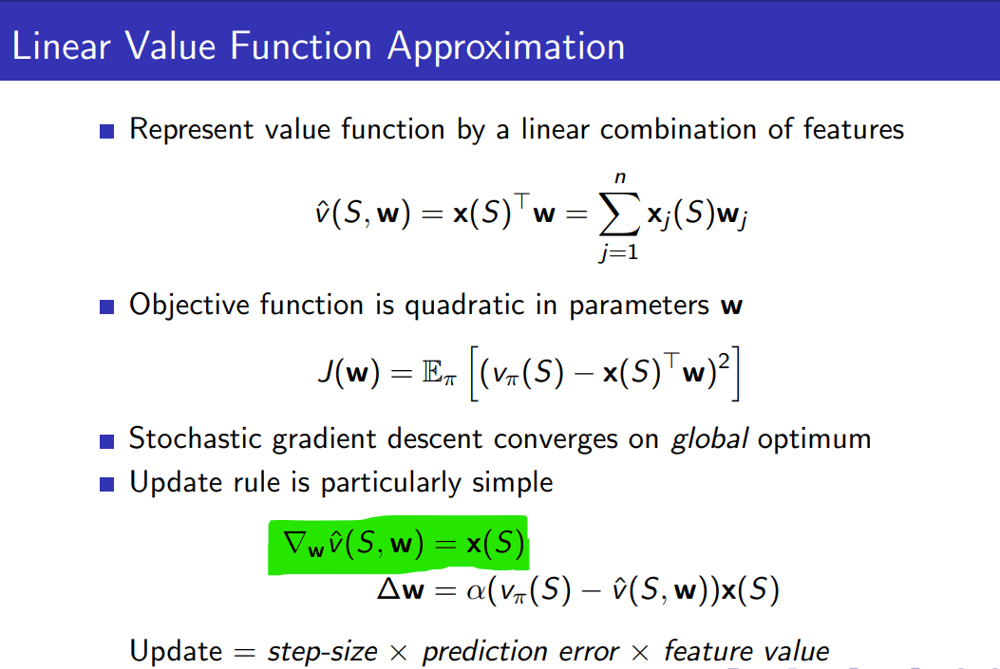
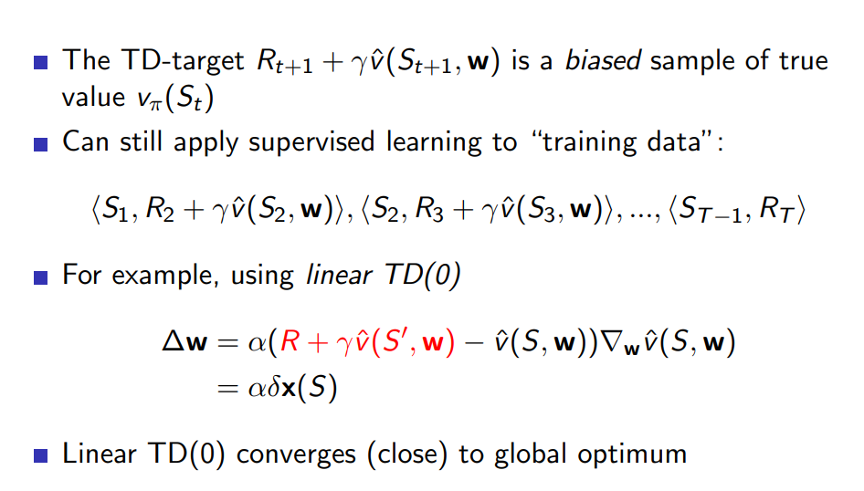
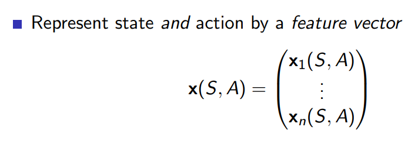

# Lecture 6 
Lecture 6: Value Function Approximation

[video](https://www.youtube.com/watch?v=UoPei5o4fps&list=PLqYmG7hTraZBiG_XpjnPrSNw-1XQaM_gB&index=8)

[slides](https://www.davidsilver.uk/wp-content/uploads/2020/03/FA.pdf)

when we scale up we need some things more

## state value approximation
* So far we have represented value function by a lookup table
* Problem with large MDPs: too many states to store in memory 
* so we approximate with some parameter w, which can be found via MC or TD methods
* assume that this is like a black box 

There are many function approximators, e.g.
* Linear combinations of features
* Neural network
* Decision tree
* Nearest neighbour
* Fourier / wavelet bases

We only consider the differentiable ones 
* Linear combinations of features
* Neural network

general
* iid stuffs wont really work here as everything is depenedent on where i was on the prev step 

Gradient Descent
* grad desc in general , to find the min of J we need to supply the correct w as J is a function of (w)
* 
* now lets use it here, which is to use it as as value approximatino function 
* 
* here we do stochastic gradient descent as opposed to gradient descent
    * in grad desc we compute the gradient 

divert
1. pick a random point in the function
1. compute the grad of the function at that point (w)
1. now update w to be : $w = w - \alpha . derivative(J(x)_{x=w})$

* grad descent does the above for all points in the dataset, stochastic samples one point and does it on that (more pref for larger datasets).

* till now we assumed some oracle gave us the actual thing of $V_{\pi}$ in the error term. 
* 

I think the feature vector is the ans of the derivative of J wrt to w, but not very sure. (yes thats correct if value function is linear)
* 
* value functions can be seen as w = [s1 s2 ... sn] where si= 1 if it has been traversed

Monte-Carlo with Value Function Approximation
* first we need some episodes of s(seq of states) and G (Reward)
* now for each (s,g) we have w = [s1 s2 ... sn] where si= 1 if it has been traversed, and in the $\triangle w$ we can use G as the oracle and repeat this for each (s,g) pair.

TD Learning with Value Function Approximation
* 
* here we have dataset as (s1, Reward(on going to next state)) pairs
* dbt : what is the feature vector (w) represented here.

## Action-Value Function Approximation

* 
* and we repeat all the above slides

## Linear Sarsa with Coarse Coding in Mountain Car
* sarsa, one step TD Q updates and greedy Q to get action 

General
* be careful with TD, use gradient TD. 
* ok basicaly post 1 hr not much idea

* 
* 
* 
* 
* 
* 
* 
* 
* 
* 
* 
* 
* 
* 
* 

