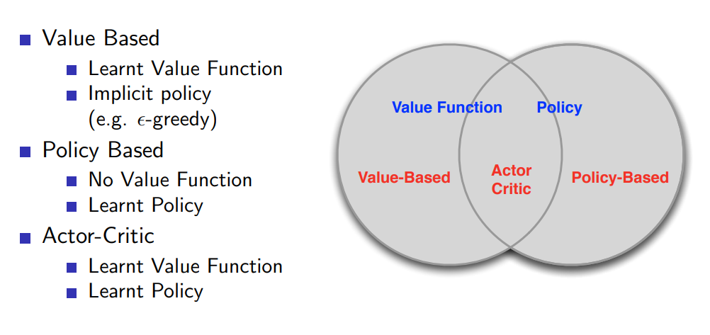
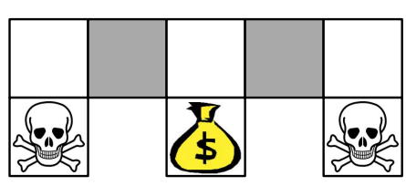
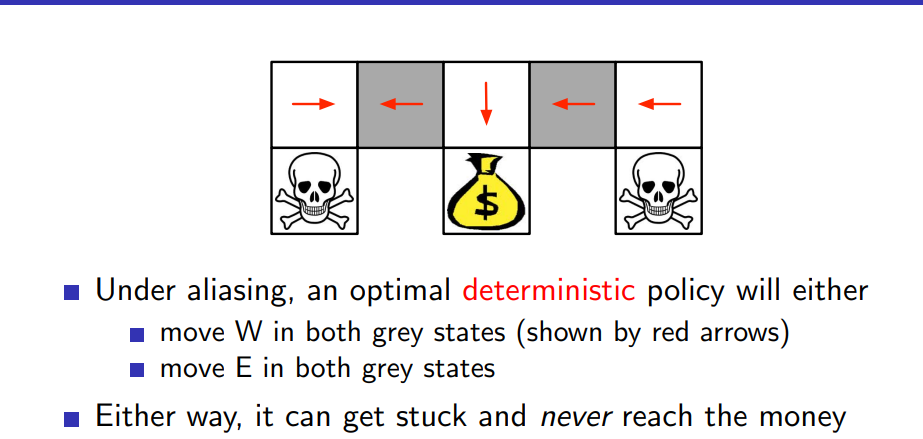
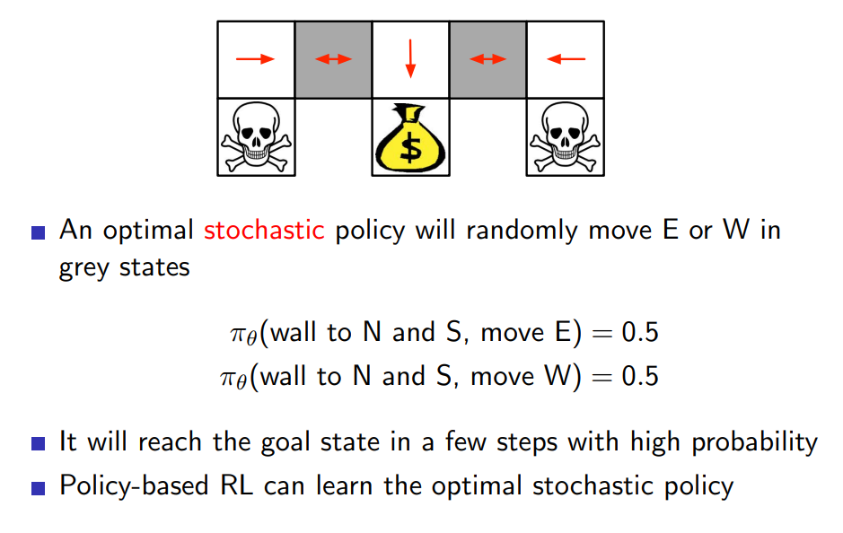
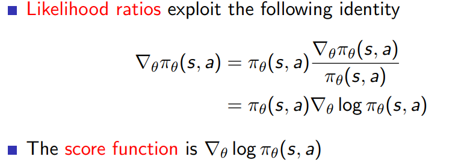
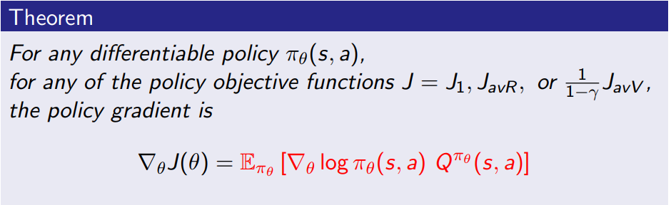
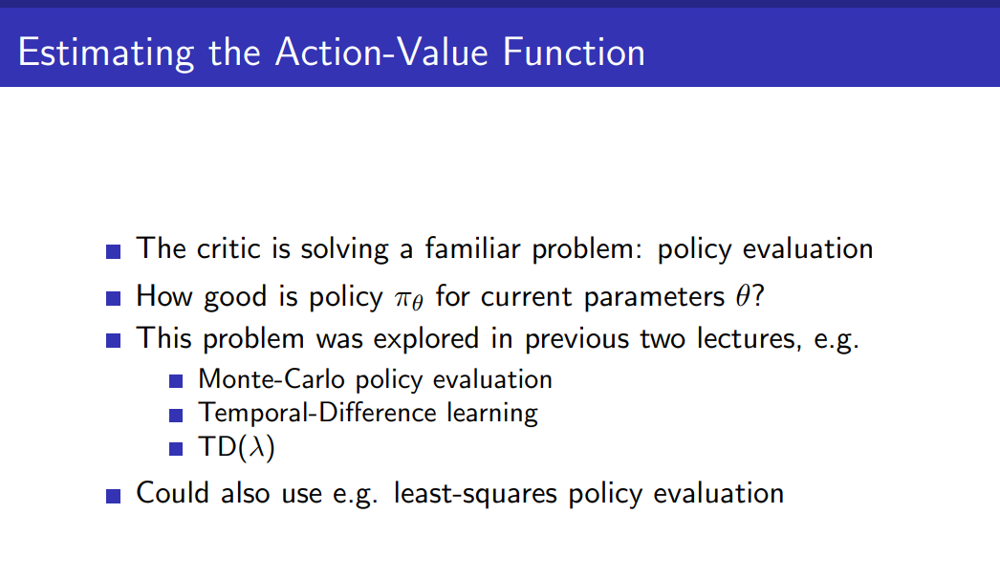

# Lecture 7

Lecture 7: Policy Gradient Methods

[video](https://www.youtube.com/watch?v=KHZVXao4qXs&list=PLqYmG7hTraZBiG_XpjnPrSNw-1XQaM_gB&index=9)

[slides](https://www.davidsilver.uk/wp-content/uploads/2020/03/pg.pdf)

* till now once we found Q, we act greedily and no policy
* today we parameterise the policy
* 
* why is it better to work with policy as opposed to value?
    * computing Value might be hard as value is like of a statte
    * policy on the other hand is just state to action more simpler to calculate (computationally)

* policy based 
    * Advantages:
        * Better convergence properties
        * Effective in high-dimensional or continuous action spaces
        * Can learn stochastic policies
    * Disadvantages:
        * Typically converge to a local rather than global optimum
        * Evaluating a policy is typically inefficient and high variance
* basically doing a max in Q is really hard as there can be many actions, but all these are not always true

* why do we even want schoastic policy  and not deterministic(having the max Q value) ? 
    *  Example: Rock-Paper-Scissors
        * any deterministic policy will be exploited
        * optimal is stochastic
    * Example: Aliased Gridworld (1)
        * 
        * each state is represented by what is there on the (N,E,S,W)
        * both the grey tiles would be indistinguishable
        * so if deterministic policy then it would be like choose the same action for both which would be bad
        * 
        * sol
        * 

## Policy Objective Functions
* **Goal: given policy πθ(s, a) with parameters θ, find best θ** 

score function
* we know dif of $\pi(s,a)$ wrt to theta
* likelihood ratios 
    * 
    * basically we mul and divide with pi and make one thing as log
    * score : max likelihood  

Policy Gradient
* 
* 
* 
* 

policy grad theorem
reinforce

### Reducing Variance Using a Critic
* 
* 

actor critic 
* from siraj
    * actor : states -> action
    * critic : (State, action) -> reward/how good it was/
*  
* 
* 
* 
* 
* 
* 
* 
* 
* 
* 
* 
* 

