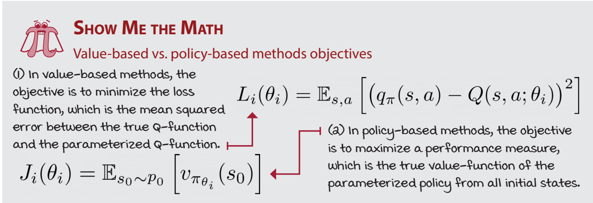
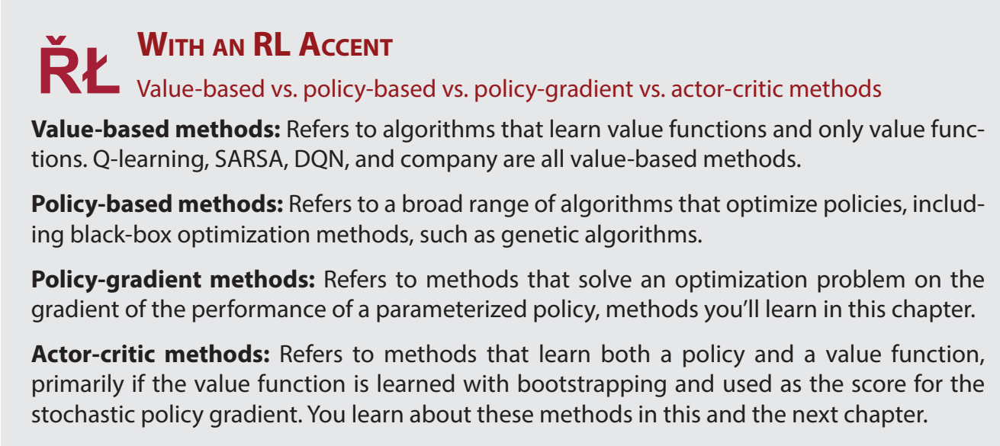
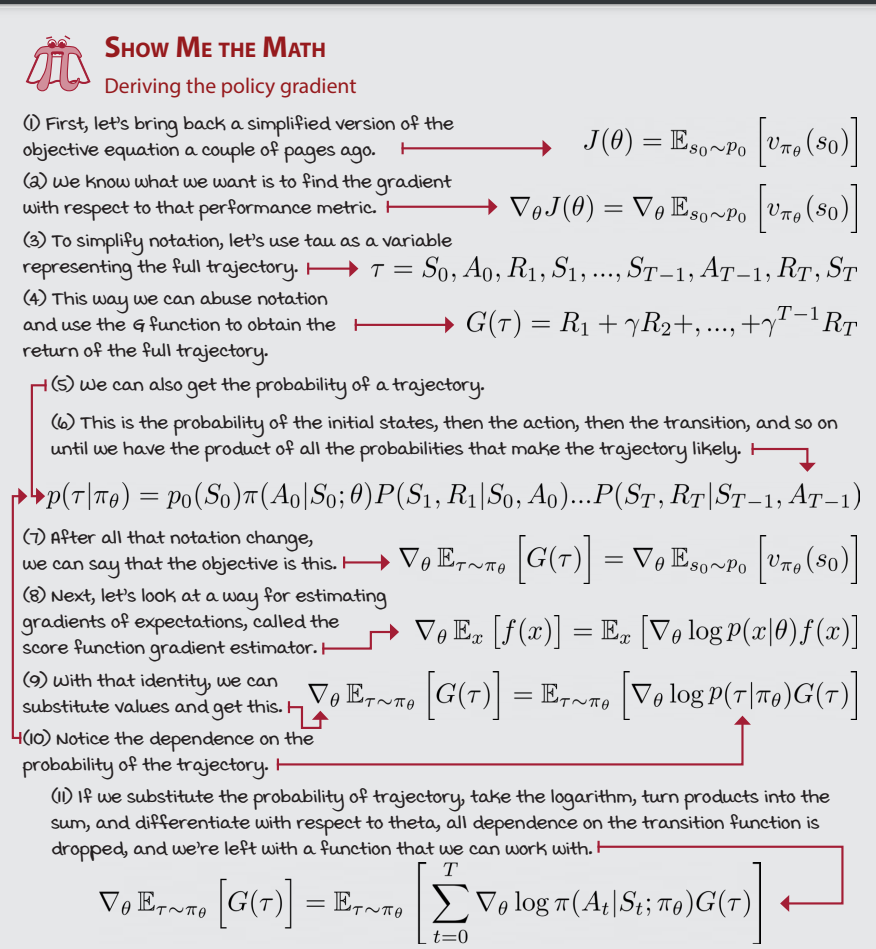
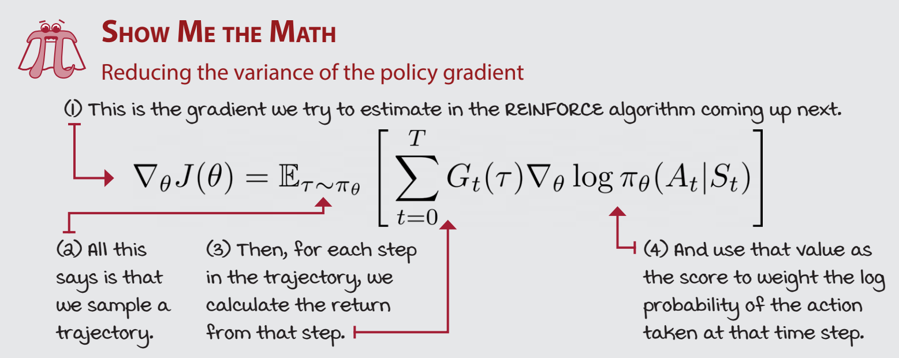
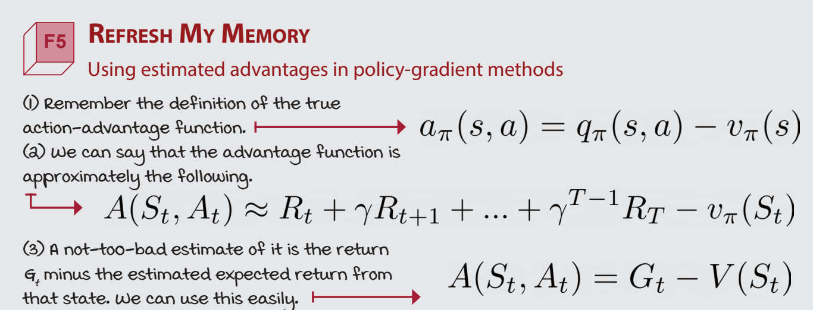
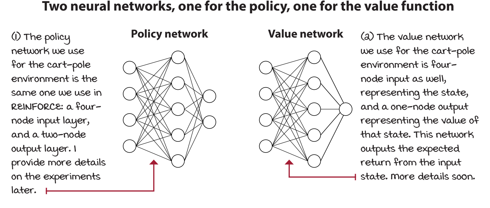

# CHapter 11


* We studied methods, referred to as policybased or policy-gradient methods, parameterize a policy and adjust it to maximize expected
returns, without the need for value functions. 
* now we do something in the middle
* we explore a combined class of methods that learn both policies and value functions.
    * policy, which selects actions, can be seen as an actor
    * value function, which evaluates policies, can be seen as a critic

## REINFORCE: Outcome-based policy learning
* simplest policy-gradient algorithm, called REINFORCE
* differnce:
    * **Value based**
    * In value-based methods, the main focus is to learn to evaluate policies
    * For this, the objective is to minimize a loss between predicted and target values
    * we parameterized a value function and minimized the mean squared error between predicted and target values.
    * Note that we didn’t have true target values, and instead, we used actual returns in Monte Carlo methods or predicted returns in bootstrapping methods
    * **Policy based**
    * objective is to maximize the performance of a parameterized policy, so we’re running gradient ascent
    * (or executing regular gradient descent on the negative performance)
    *  It’s rather evident that the performance of an agent is the expected total discounted reward from the initial state, which is the same thing as the expected state-value function from all initial states of a given policy
* 
* 
* 
* Advantages of policy-gradient methods
    * policies can now be any learnable function
    * value based has a disadvantaage in continous spaces
        * n. In value-based methods, we worked with discrete action spaces, mostly because we calculate the maximum value over the actions. In high-dimensional action spaces, this max could be prohibitively expensive. Moreover, in the case of continuous action spaces, value-based methods are severely limited
    * Learning policies could be an easier, more generalizable problem to solve than value based which are hard to compute
* One of the main advantages of optimizing policies directly is that, well, it’s the right objective. We learn a policy that optimizes the value function directly, without learning a value function, and without taking into account the dynamics of the environment. 
* 
* Reducing the variance of the policy gradient
* 
* 
```python
def reinforce:

    def optimiise_policy():
        returns = [ discounts[i] * reward[i], for i in timeline]
        policy_loss = returns.mean()
        # actually above is discount * returns.mean
        
        # making gradients as zero
        self.policy_optimizer.zero_grad()
        
        # backward pass
        policy_loss.backward()

        # step in the direction of the gradient
        self.policy_optimizer.step()

    def interaction_step:

```
* general about back propgation and stuff
```
chatgpt: 

Backpropagation is a process used in artificial neural networks to calculate a gradient that is needed in the calculation of the weights to be used in the network. It is commonly used to train deep neural networks.


A simple example of backpropagation could be a two-layer neural network. In this network, we have two input nodes, two hidden nodes and one output node. The weights of the connections between nodes are represented as w1, w2, w3 and w4. 

The input to the network is x1 and x2. The output of the network is y. The goal of backpropagation is to update the weights of the network in order to minimize the error between the actual output of the network and the desired output y. 

To do this, we first need to compute the error of the network, which is the difference between the actual output and the desired output. This can be done using the following equation: 

Error = (y - Output)2

Next, we need to calculate the gradient of the error with respect to the weights. This can be done using the chain rule: 

dError/dw1 = dError/dOutput * dOutput/dw1
dError/dw2 = dError/dOutput * dOutput/dw2
dError/dw3 = dError/dOutput * dOutput/dw3
dError/dw4 = dError/dOutput * dOutput/dw4

We can then update the weights of the network using the following equations: 

w1 = w1 - learning_rate * dError/dw1
w2 = w2 - learning_rate * dError/dw2
w3 = w3 - learning_rate * dError/dw3
w4 = w4 - learning_rate * dError/dw4

The learning rate is a hyperparameter that determines how quickly the weights are updated. 

This process is repeated until the error is minimized. 
```
* we use full monte carlo for calculating gradient, variance is a problem.  
* high variance means that it takes longer to train since it requires more data points to converge on a solution.


## VPG: Learning a value function
* Vanilla policy gradient a.k.a. REINFORCE
* Further reducing the variance of the policy gradient
* REINFORCE is a principled algorithm, but it has a high variance.
* One way for reducing the variance is to use partial returns instead of the full return for changing the log probabilities of actions.
* Using estimated advantages in policy-gradient methods
*  

Learning a value function
* we can further reduce the variance of the policy gradient by
using an estimate of the action-advantage function, instead of the actual return.
* 
* adding entropy can be good : pls refer
* code
```python
def FCV():
    # similar to neural network
    
```
* 


