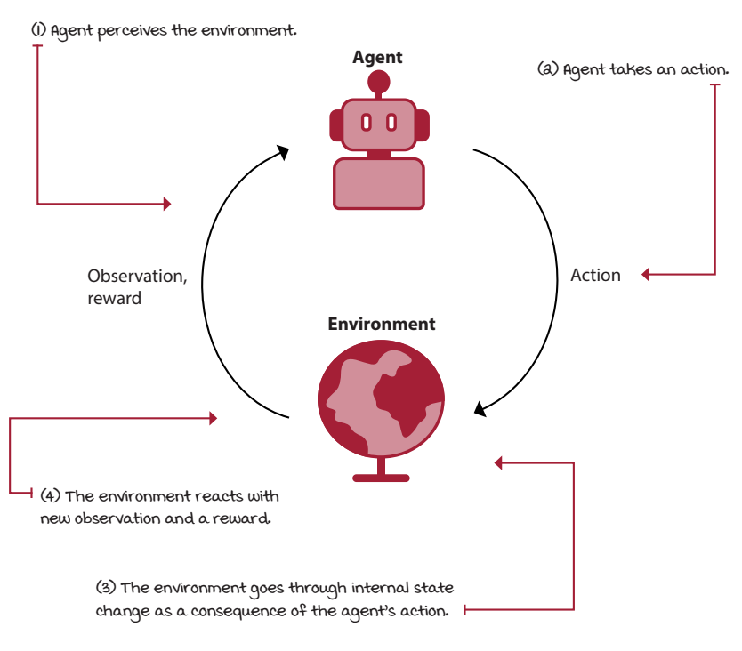
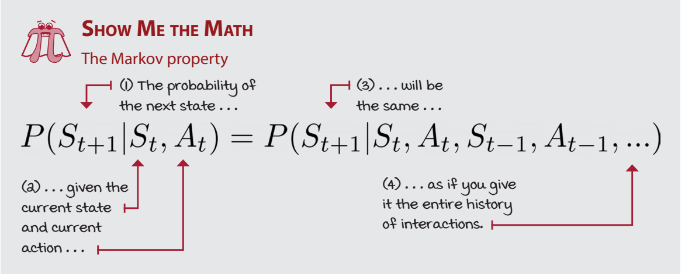
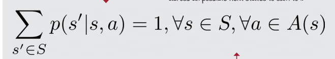
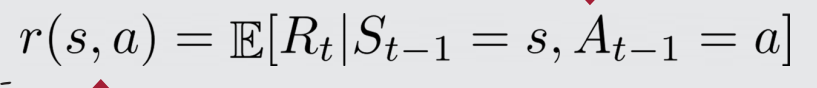
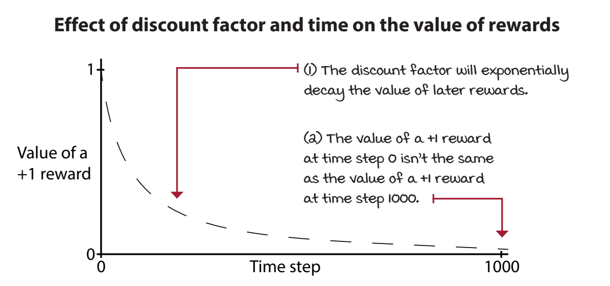
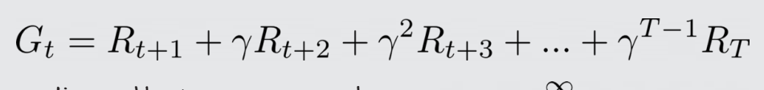
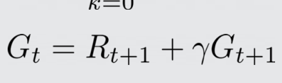
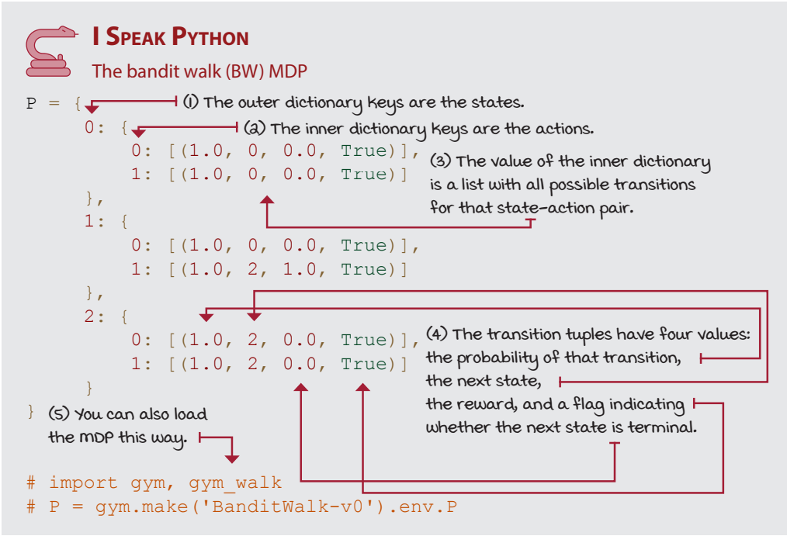
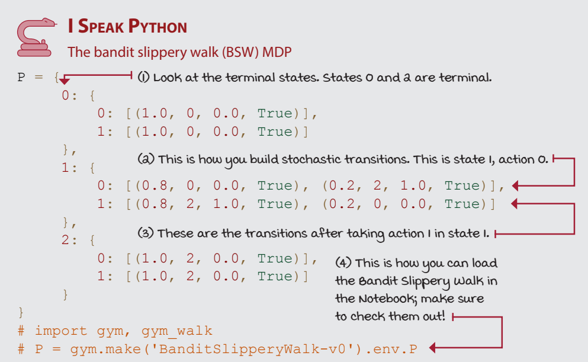
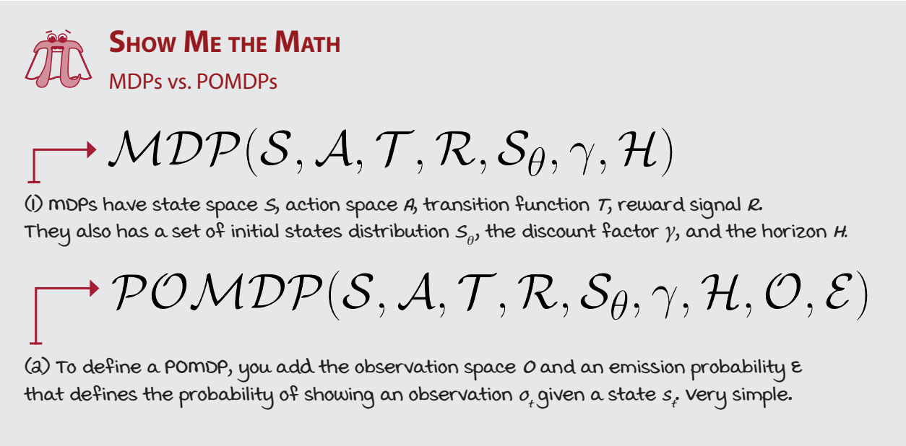

# Chapter 2 

Mathematical foundations of reinforcement learning 

Introduction
* Markov decision processes (MDPs) allows us to model virtually any complex sequential decision-making problem under uncertainty in a way that RL agents can interact with and learn to solve solely through experience.

NOTE: it is hard to evaluate feedback since we dont what seems to be better: parable of the chinese farmer and his horses.

general
* The agent: The decision maker
* The set of transition and reward function is referred to as the model of the environment
* 
* 

pg 62

* there are fully observable and paritially observable, that is where observations come into play
* Tasks that have a natural ending, such as a game, are called episodic tasks.
* Tasks that don’t, such as learning forward motion, are called continuing tasks
*  The **sum of rewards** collected in a single episode is called a **return**. 
* **Agents are often designed to maximize the return**
* The agent may be designed to learn mappings **from observations to actions** called *policies*
* The agent may be designed to learn mappings **from observations to new observations** and/or rewards called *models*
* MDPs: The engine of the environment
* 
* 
* 
* Discount: The future is uncertain, value it less
* discount factor exponentially diminishing
* 
* 
* G : return, R: Reward
* 
* 
* 
* 
* 
* 
* 
* 

