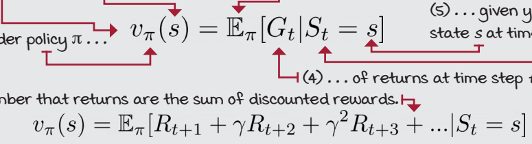
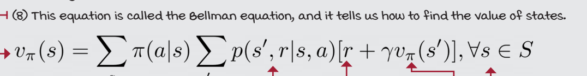
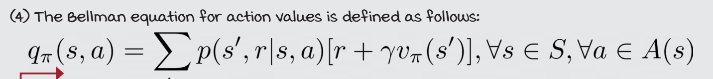
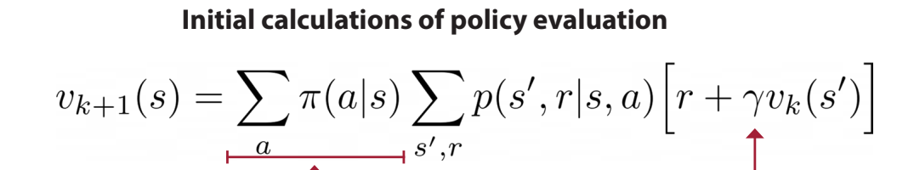
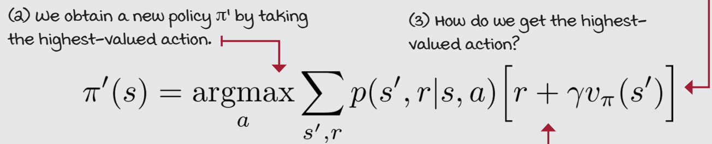

# Chapter 3 : Balancing immediate and long-term goals 

Two fundamental algorithms for solving MDPs under a technique called dynamic programming:
* value iteration (VI) and 
* policy iteration (PI).


These above methods in a way “cheat”: they require full access to the MDP, and they depend on knowing the dynamics of the environment, which is something we can’t always obtain, but for now lets just roll with this

You’ll also notice that when an agent has full access to an MDP
* no need of exploration as no uncertainity

In DRL agents learn from feedback that’s
* 
* 
* 
* 

shortcuts
* The frozen lake (FL) environment 
* stochastic vs deterministic

Policy
* Policy : f(state) = action
* How can we compare policies?
    * Policy comparison in RL can be done by comparing the expected cumulative reward of the policies 

Value / (State-value) function
* how much is better is being in state s1 than in state s2
* V(s) = number
* 
* Bellman equation
* 


Q-function / Action-value function
* The value of taking action a in a state s
* In fact, when we care about improving policies, which is often referred to as the control
problem, we need action-value functions.
* The Q-function capture the dynamics of the environment and allows you to improve policies without the need for MDPs
* 
* bellman
* 


Action-advantage function
* How much better if I do that?
* 

Optimality
* An optimal policy is a policy that for every state can obtain expected returns greater than or
equal to any other policy
* An optimal state-value function is a state-value function with the maximum value across all policies for all states
* Notice that although **there could be more than one optimal policy** for a given MDP
* You may also notice that if you had the optimal V-function, you could use the MDP to do a one-step search for the optimal Q-function and then use this to build the optimal policy
* if you had the optimal Q-function, you don’t need the MDP at all. You could use the optimal Q-function to find the optimal V-function by merely taking the maximum over the actions

evaluating a policy
* iterative policy eval
* 
* initially make all V as 0
* then find the results of round 1 and then so on 
* the value eventually converges then we stop iterating the loops 

Now can we improve a policy
* The key to unlocking this problem is the action-value/Q function 
* acting greedily with respect to the action-value function gave us an improved policy. This is what the policy-improvement algorithm
* The policy-improvement equation 
* 

Policy iteration: What happens actually
* start with a random policy
* do policy eval and improve
* repeat above step
* 
```python
def policy_iteration(P, gamma=1.0, theta=1e-10):
    
    random_actions = np.random.choice( tuple(P[0].keys()), len(P))
    pi = lambda s: {s:a for s, a in enumerate(random_actions)}[s]

    while True:
        old_pi = {s:pi(s) for s in range(len(P))}
        V = policy_evaluation(pi, P, gamma, theta)
        pi = policy_improvement(V, P, gamma)
        if old_pi == {s:pi(s) for s in range(len(P))}:
            break
    
    return V, pi

```
* policy_eval gives us the V function (after it converges)
* we then compute Q with V
* then do greedy on that Q to get a better policy

## IMPORTANT NOTE
* An MDP can have **more than one optimal policy**, but it can only have **a single optimal state-value** function
* policy iteration always comes to global optimium and not local optimum (if ties dealt non-randomly.)


Value iteration:
* “greedily greedifying policies”
* basically without finishing 1 full policy eval we do policy imporovement
* and we dont do this with state value functions but rather Q values.
* Value iteration is more efficient than policy iteration.
```python
def value_iteration(P, gamma=1.0, theta=1e-10):
    V = np.zeros(len(P), dtype=np.float64)
    while True:
        Q = np.zeros((len(P), len(P[0])), dtype=np.float64)
        for s in range(len(P)):
            for a in range(len(P[s])):
                for prob, next_state, reward, done in P[s][a]:
                    Q[s][a] += prob * (reward + gamma * V[next_state] * (not done))
    
        if np.max(np.abs(V - np.max(Q, axis=1))) < theta:
            break
        V = np.max(Q, axis=1)
    pi = lambda s: {s:a for s, a in enumerate(np.argmax(Q, axis=1))}[s]
    return V, pi
```
* **main advantage here is there is no policy eval here its like direct greedy policy only repeatedly** 
* NOTE both value iteration and policy iteration are for optimal policy findning
* done and dusted


