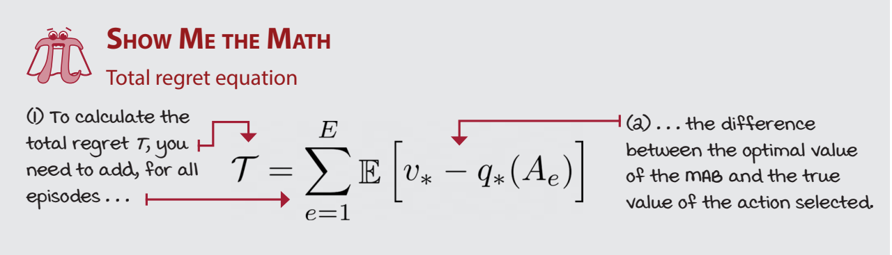
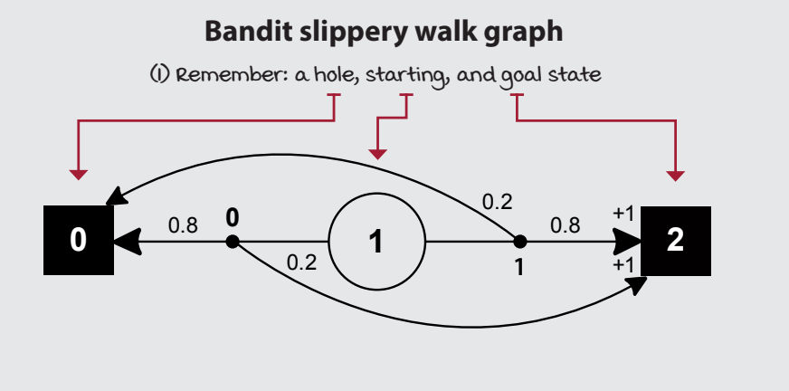
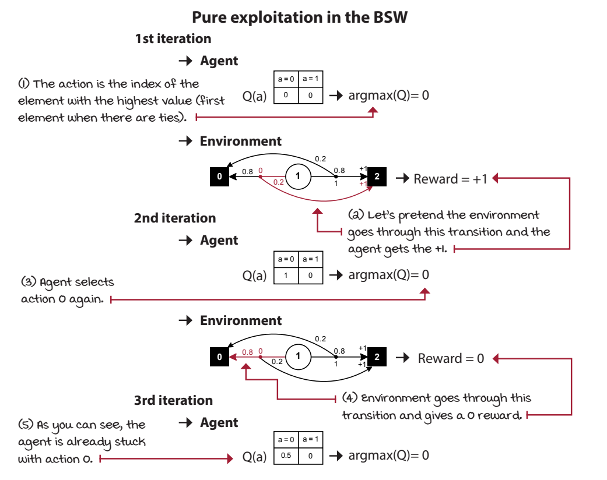
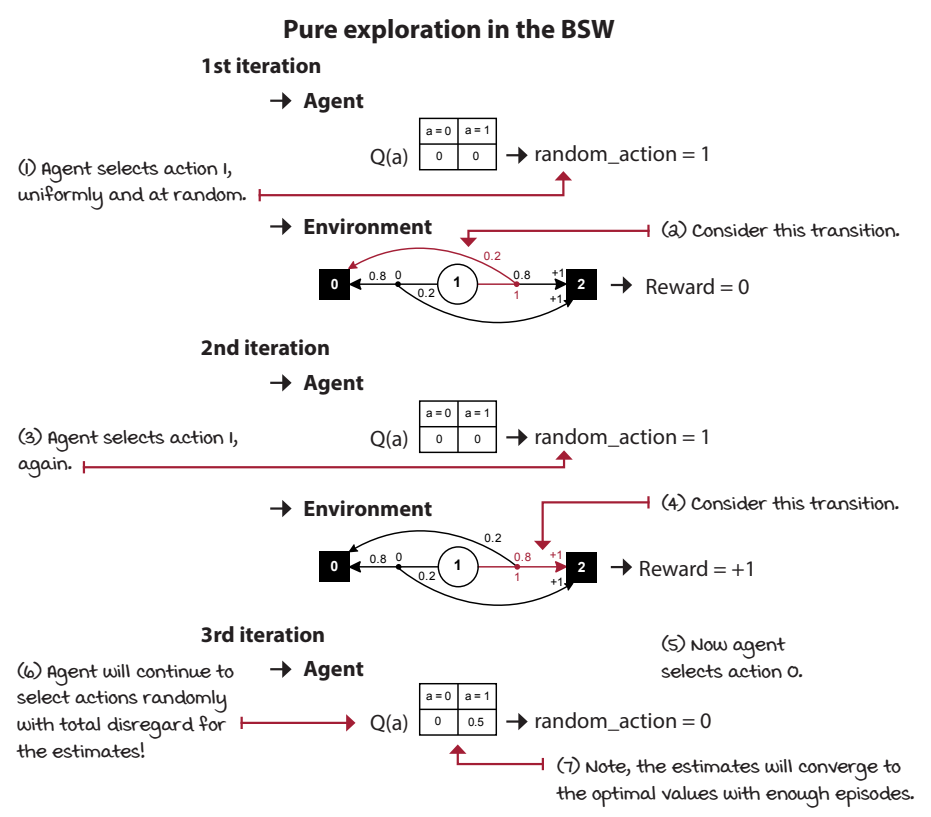
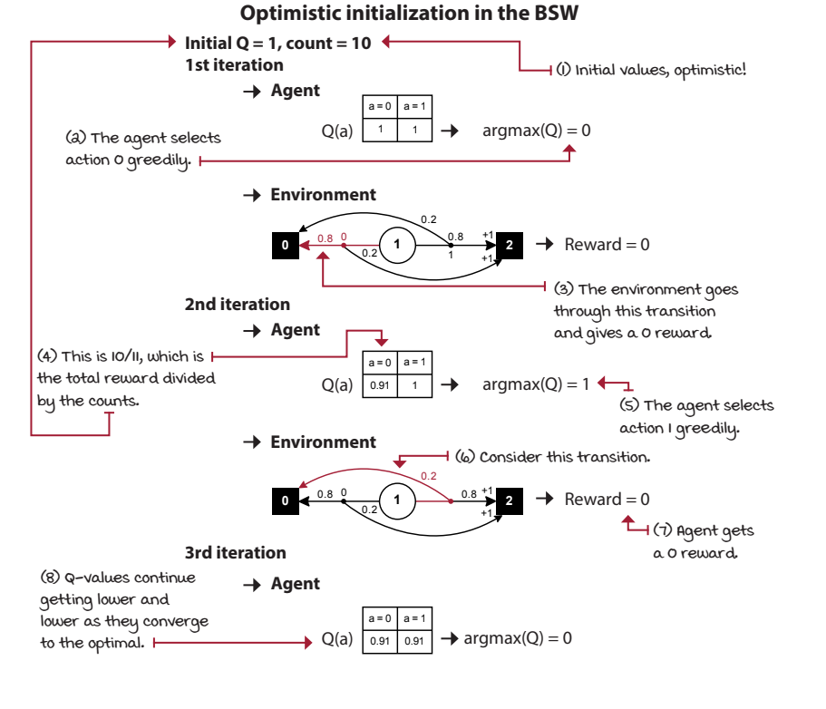
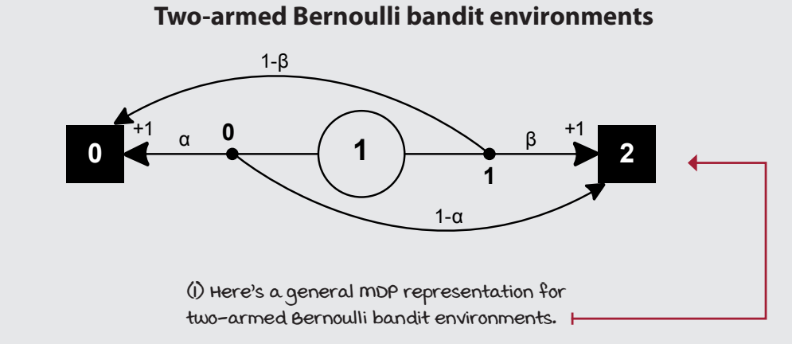
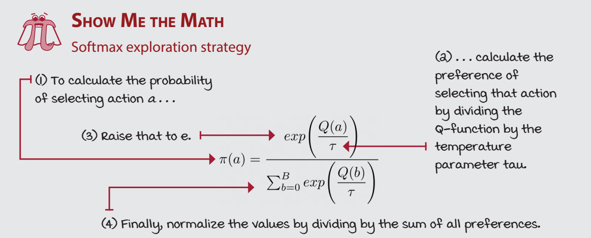
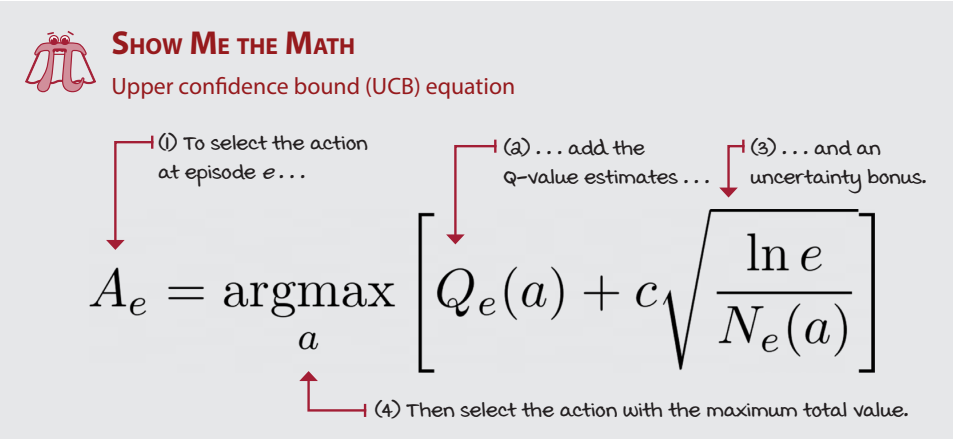

# Chapter 4 
Balancing the gathering and use of information

Why do we even need exploration? 
* **otherwise, we risk convergence to a suboptimal action** 

this chapter, we examine the challenges of learning from evaluative feedback, and we do so in environments that aren’t sequential, but one-shot instead: multi-armed bandits (MABs). 

* Remember, in DRL, agents learn from feedback that’s simultaneously sequential (as
opposed to one shot), evaluative (as opposed to supervised), and sampled (as opposed to
exhaustive)

Bandits: Single-state decision problems
* many-options, single-choice” environment.
* exploration vs expoloitation
* single state, multiple actions

Regret: The cost of exploration
* total regret :  we sum the per-episode difference of the true expected reward of the optimal action and the true expected reward of the selected action.
* 

Approaches to solving MAB environments
*  random exploration strategies : involves exploring by injecting randomness in our action-selection process
* optimistic exploration strategies: quantify uncertainities, the ones you havent explored yet will be uncertain and the algo has highest pref for highest uncertain states
    * The bottom line is that being optimistic will naturally drive you toward uncertain states because you’ll assume that states you haven’t experienced yet are the best they can be. This assumption will help you explore, and as you explore and come face to face with reality, your estimates will get lower and lower as they approach their true values.
* information state-space exploration strategies: idk ...

## Concrete Example
* bandit slippery walk
* only 1 action (since MAB), then it reaches terminal state
* since 2 terminal states this is 2 armed bandits
* internals of the MDP are unknown  (for example assume the below one and lets see how fast we can solve this )
* 
* we look over different strategies to solve the same

### Greedy: Always exploit
* baseline
* no exploration
* 
* always stuck with the first action
* `Q[action] = Q[action] + (reward - Q[action])/N[action]`
* `Q[action] = Q[action] + (reward - Q[action])/iteration_number`

### Random: Always explore
* pure exploration, random action always
* 
* while there’s only a single way to exploit, there are multiple ways to explore

### Epsilon-greedy: Almost always greedy and sometimes random
* combination of above 2 
* do exploration if math.random()>epsilon

### Decaying epsilon-greedy: First maximize exploration, then exploitation
* decay the epsilon above

### Optimistic initialization: Start off believing it’s a wonderful world
* optimism in the face of uncertainty
* init Q values of all actions as max
* 
* The bottom line is if you’re going to act greedily, at least be optimistic.
* this is pure exploitation with a wrong/different/optimistic Q initialisation

Recap: Two-armed Bernoulli bandit environment
* Two-armed Bernoulli bandit environments have a single non-terminal state and two
actions. Action 0 has an α chance of paying a +1 reward, and with 1–α, it will pay 0 rewards.
Action 1 has a β chance of paying a +1 reward, and with 1–β, it will pay 0 rewards
* 

## Strategic exploration

Softmax: Select actions randomly in proportion to their estimates
* sample an action from a probability distribution over the action-value function 
* difference with epislon greedy 
    * Epsilon-greedy samples uniformly at random from the full set of actions available at a given state, while softmax samples based on preferences of higher valued actions.
* hyper- parameter : temperature
* 

upper confidence bound (UCB): It’s not about optimism, it’s about realistic optimism
* problems with optimism before,
    * we dont know what values to initialse the q values with, if its more than the max then it will cause the algo to be sub optimal as it will take more time to converge,  
    * if set to below that, then is no longer optimistic
* here we give a bonus to uncertain (or low confidence states)
* 

Thompson sampling: Balancing reward and risk
* no idea, pls refer

10-armed Gaussian bandit environments
* from one state we have options to choose one of 10 actions, but end result will be terminal state

ending notes
* When learning from evaluative feedback, that is, +1, +1.345, +1.5, –100, –4,
your agent doesn’t know the underlying MDP and therefore cannot determine what the maximum reward it can obtain is. Your agent “thinks”: “Well, I got a +1, but I don’t know, maybe
there’s a +100 under this rock?” This uncertainty in the environment forces you to design
agents that explore.
* 
* 
* 
* 

