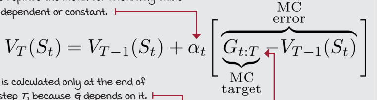
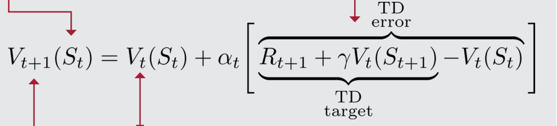

# Chapter 5 
Evaluating agents’ behaviors
* You will learn about estimating policies when learning from feedback that is simultaneously sequential and evaluative

## Learning to estimate the value of policies
* Terms
    * Reward: Refers to the one-step reward signal
    * Return: Refers to the total discounted rewards.
    * Value function: Refers to the expectation of returns

THings slowly getting complex

First-visit Monte Carlo: Improving estimates after each episode
* run several episodes with this policy collecting hundreds of trajectories, and
then calculate averages for every state
* Monte Carlo prediction (MC).
* 

Every-visit Monte Carlo: A different way of handling state visits

* difference- MC prediction estimates vπ (s) as the average of returns of π. FVMC uses only one return per state per episode: the return following a first visit. EVMC averages the returns following all visits to a state, even if in the same episode.  

Temporal-difference learning: Improving estimates after each step
* One of the main drawbacks of MC is the fact that the agent has to wait until the end of an
episode when it can obtain the actual return Gt:T before it can update the state-value function
estimate VT(St)
* due to the high variance of the actual returns Gt:T, MC can be sample inefficient
    * All of that randomness becomes noise
* main difference, one uses actual returns and other uses estimated returns 
* 
* MC and TD both nearly converge to the true state-value function
* MC estimates are noisy; TD estimates are off-target
* MC targets high variance; TD targets bias

## Learning to estimate from multiple steps
* something in between TD and MC 

N-step TD learning: Improving estimates after a couple of steps
* 
* David silverman does it better

Forward-view TD(λ): Improving estimates of all visited states
* what is a good n value, then ?
* 
* 
* 
* 
* 
* 

