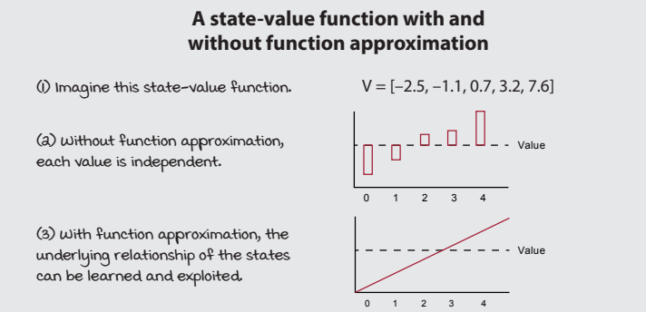
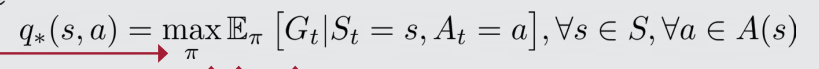
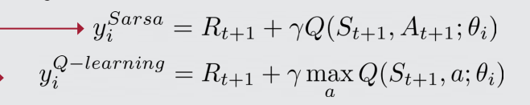
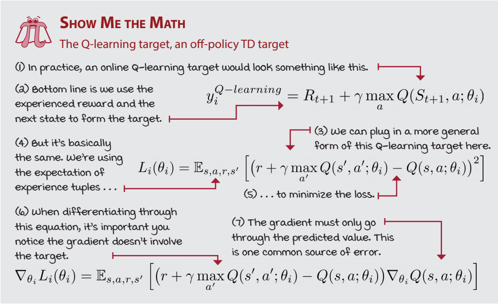
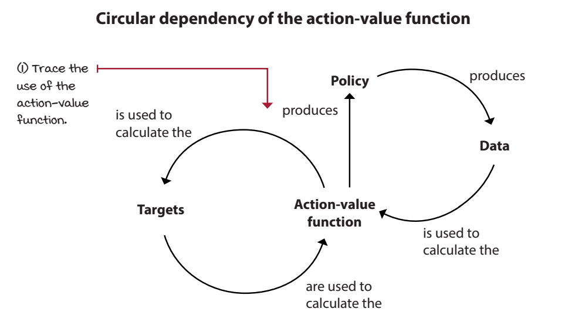
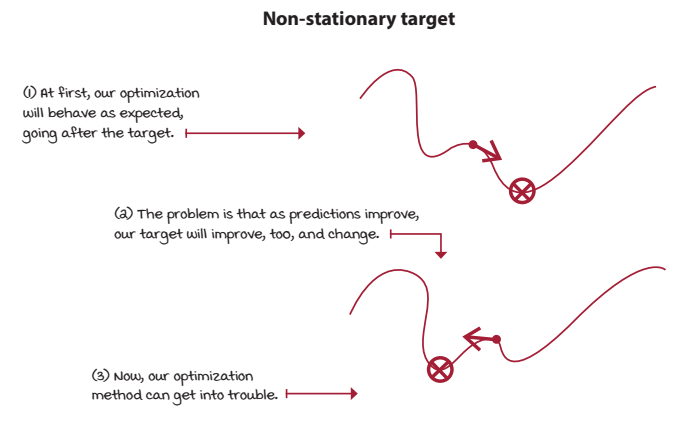

# Chapter 8
Introduction to value-based deep reinforcement learning

* we begin our incursion into the use of deep neural networks for solving reinforcement learning problems.

## The kind of feedback deep reinforcement learning agents use
* Delayed feedback makes it tricky to interpret the source of the feedback
*  Sequential feedback gives rise to the temporal credit assignment problem, which is the challenge of determining which state, action, or state-action pair is responsible for a reward
* The opposite of delayed feedback is immediate feedback.
* the opposite of sequential feedback is one-shot feedback.

But, if it isn’t sequential, what is it?
* the prob is we dont know which action and how long back caused the rewards we now experience unlike in DRL, where there is no long term conseq but only like batches
*  In other words, the opposite of sequential feedback is one-shot feedback.

But, if it isn’t evaluative, what is it?
* The opposite of evaluative feedback is supervised feedback. In a classification problem, your model receives supervision; that is, during learning, your model is given the correct labels for each of the samples provided. There’s no guessing. If your model makes a mistake, the correct answer is provided immediately afterward. What a good life!
* Nobody is there to tell you; there’s no supervision. 

But, if it isn’t sampled, what is it?
* opposite is exhausted
* You can’t expect exhaustive feedback from life. You can’t be a doctor and a lawyer and an engineer all at once, at least not if you want to be good at any of these.
* the core challenge in supervised learning is to learn from sampled feedback: to be able to generalize to new samples, which is something neither multi-armed bandit nor tabular reinforcement learning problems do.
* What if the environment state space has continuous variables, such as a robotic arm indicating joint angles? How about problems with both
high-dimensional and continuous states or even high-dimensional and continuous actions? These complex problems are the reason for the existence of the field of deep reinforcement learning

Introduction to function approximation for reinforcement learning
* Reinforcement learning problems can have high-dimensional state and action spaces 
* The main drawback of tabular reinforcement learning is that the use of a table to represent value functions is no longer practical in complex problems.
* number of variables that comprise a single state is vast
* Reinforcement learning problems can have continuous state and action spaces

* 

## NFQ: The first attempt at value-based deep reinforcement learning
* neural fitted Q (NFQ) iteration

1. First decision point: Selecting a value function to approximate
1. Second decision point: Selecting a neural network architecture
    * State-action-in-value-out architecture
    * State-in-values-out architecture
1. Third decision point: Selecting what to optimize
    * An ideal objective in valuebased deep reinforcement learning would be to minimize the loss with respect to the optimal action-value function q*
    * 
    * we want to minimise the difference between the actual q* and our estimate Q 
    * but we dont have q*
    * 
1. Fourth decision point: Selecting the targets for policy evaluation
    * Often in the literature, the on-policy version of this target is called the SARSA target, and the off-policy version is called the Q-learning target.
1. On-policy and off-policy TD targets
    * 
    * 
1. Fifth decision point: Selecting an exploration strategy
    * balance the exploration-exploitation trade-off, and almost any of those techniques would work fine. But in an attempt to keep it simple, we’re going to use an epsilon-greedy strategy on our NFQ implementation
1. Sixth decision point: Selecting a loss function
    * MSE (mean squared error, or L2 loss)
    * 
1. Seventh decision point: Selecting an optimization method
    * batch gradient descent, momentum , schoastic etc

Things that could (and do) go wrong
* There are two issues with our algorithm. F
    * Non-stationary target
    * 
* Data correlated with time
    * All this means that we aren’t holding the IID assumption, and this is a problem because optimization methods assume the data samples they use for training are independent and identically distributed. But we’re training on almost the exact opposite: samples on our distribution are not independent because the outcome of a new state s is dependent on our current state s.
    * 
* 

