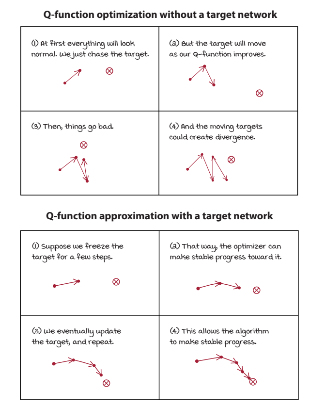
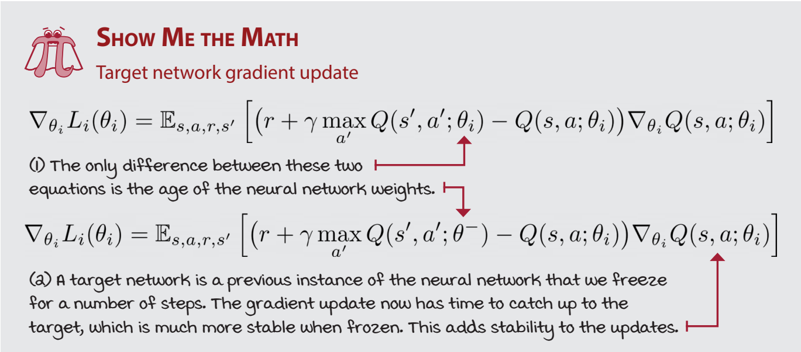

# Chapter 9
More stable value-based methods

## DQN: Making reinforcement learning more like supervised learning

* Data isn’t independently and identically distributed (IID)
* Non-stationarity of targets
* 
* 
* ok not continuinig and skiipping to ch11
* 
* 

