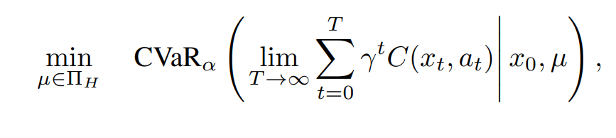

# Chapter 2

Risk-Sensitive Decision Making: A CVaR Optimization Approach

*  CVaR [7, 112] is a risk-measure that is rapidly gaining popularity in various engineering applications, for instance, finance, due to its favorable computational properties [7] and superior ability to safeguard a decision maker from the “outcomes that hurt the most”
* CVaR of a discounted cost in an MDP is equivalent to the expected value of the same
discounted cost in the presence of worst-case perturbations of the MDP parameters

Contributions
*  we provide a novel interpretation for CVaR MDPs in terms of robustness to modeling errors
* Second, we provide a new optimization algorithm for CVaR MDPs,
* 
* 
* 
* 
* 
* 
* 
* 
* 
* 
