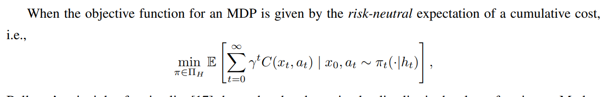
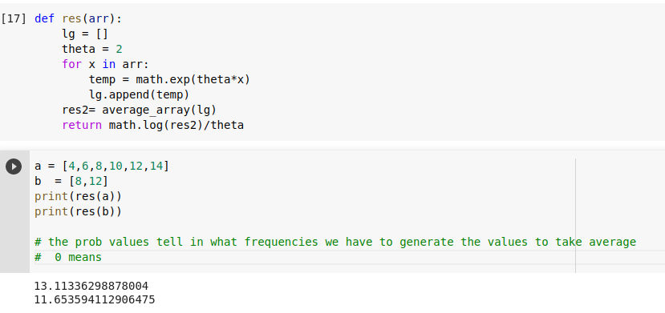
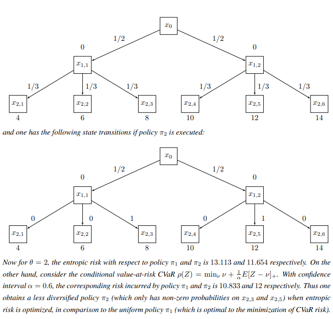

# Intro 

[ref](https://stanfordasl.github.io/wp-content/papercite-data/pdf/Chow.PhD17.pdf)

# chapter 1 : introduction

The most widely-adopted optimization criterion for sequential decision-making is represented by the
risk-neutral expectation of a cumulative cost. However despite its popularity, this criterion does not take
variability of the cost and sensitivity to modeling errors into account

## 1.3.1 Sources of Uncertainty in MDPs

we hereby describe the two sources of uncertainty, i.e., inherent-uncertainty
and model-uncertainty, incurred by the cumulated cost random variable. Inherent-uncertainty describes the
uncertainty from stochastic transitions of a single, well-defined MDP. On the other hand, model-uncertainty
characterizes the inaccuracy of transition probability and immediate cost of an MDP

Risk-sensitive MDPs [61] *address the first aspect* by replacing the risk-neutral expectation with a risk-measure of the total discounted cost,
such as exponential utility, a variance-related measure and percentile risk measures (namely Value-at-Risk (VaR), or Conditional-VaR (CVaR))

Robust MDPs [92], on the other hand, address the second aspect by
defining a set of plausible MDP parameters and optimize decision with respect to the expected cost under worst-case parameters.

**Indeed by using the representation theorem of coherent risk (Theorem 1.3.3), one
can also show that Robust MDPs are equivalent to risk-sensitive MDPs with dynamic coherent risk metrics.**
>> Thus the problem of controlling cost variability and robustness in modeling errors of MDPs is equivalent to risk shaping, i.e., to construct a “good” risk criterion in a manner that is both conceptually meaningful and computationally tractable.

## 1.3.2 Entropic Risk and its Limitations

WHY entropic risk not always works 

## 1.3.3 Percentile Risk Metrics

In this paper we interpret Z as a cost. The value-at-risk (VaR)
at confidence level α ∈ (0, 1) is the 1 − α quantile of Z

Moreover, VaR is not a coherent risk measure [7] and more importantly does not
quantify the losses that might be suffered beyond its value at the α-tail of the distribution 

Therefore, CVaRα(Z) may be interpreted as the worst-case expected value of Z
* CVaR is especially useful for controlling rare, but potentially disastrous events, which occur below the 1−α quantile, and are neglected by VaR [127]
* CVaR1(Z) equals to E(Z), and CVaRα(Z) tends to max(Z) as α ↓ 0

Accordingly, in Chapter 2 and 3, we will focus on sequential decision making with percentile risk measures characterized by VaR and CVaR

## stuff afterwards

* The most common strategy to model risk awareness in MDPs is to consider a static risk (i.e., a metric assessing risk from the perspective of a single point in time) applied to the entire stream of future costs
*  However, since static risks do not involve an incremental reassessment of uncertainties at subsequent decision stages, they generally lead to irrational behaviors

Variance-constrained planning
* Consider the example in Figure 1.2 in which all the cost functions are homogeneous in time. When the risk threshold r0 is below 25, policy π1 is infeasible and the optimal policy is π2. According to policy π2, if the decision maker does not incur a cost in the first stage it seeks to incur losses in subsequent stages to keep the
variance small. This can be seen as a consequence of the fact that Bellman’s principle of optimality does not hold for this class of problems.
* **WOW i did not know, but i dont understand it also**

Chance-constrained planning
* 
* 
* 
* 
* 
* 
* 
* 
* 
* 

