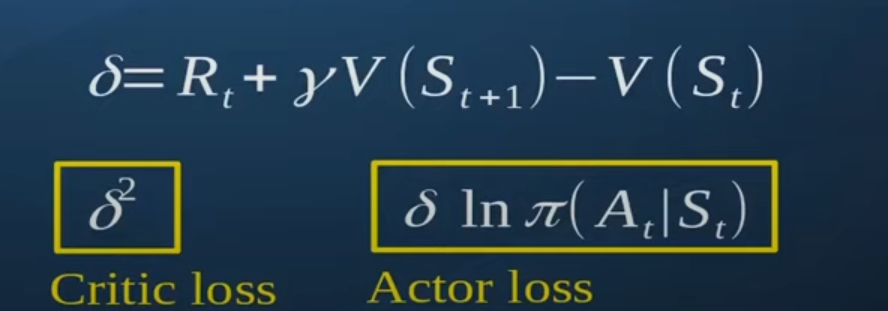
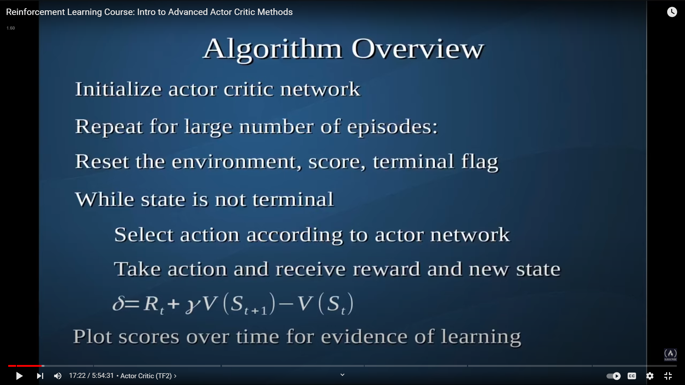

# Actor Critic Free code camp

<!-- https://arxiv.org/pdf/1810.09126.pdf
prashant sir book for later ref -->

[link](https://www.youtube.com/watch?v=K2qjAixgLqk&t=2s)

## Actor critic 

* discrete action space
* 
* i think the V value of terminal state is 0 as starting from that state you dont get any more reward ? i am not sure double check

* actor - approximates policy 
* critic - approximates Value 
* actor critic methods are in the fam of TD learning 
* learn at each step
* 2 costs for updating actor and critic
* 
* 
* we can have  1 network (with 2 outputs) instead of 2 for actor critic 
* 
* 
* 
* 
* 
* 
* 
* 
* 
* 
* 
* 
* 

