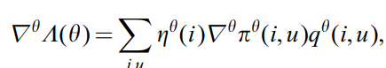

# Actor Critic Free code camp

<!-- https://arxiv.org/pdf/1810.09126.pdf
prashant sir book for later ref -->

[link](https://www.youtube.com/watch?v=K2qjAixgLqk&t=2s)

## Actor critic 

* discrete action space
* 
* i think the V value of terminal state is 0 as starting from that state you dont get any more reward ? i am not sure double check

* actor - approximates policy 
* critic - approximates Value 
* actor critic methods are in the fam of TD learning 
* learn at each step
* 2 costs for updating actor and critic
* 
* 
* we can have  1 network (with 2 outputs) instead of 2 for actor critic 

## medium 2 
[link](https://medium.com/intro-to-artificial-intelligence/the-actor-critic-reinforcement-learning-algorithm-c8095a655c14#:~:text=In%20a%20simple%20term%2C%20Actor,based%20on%20policy%20gradient%20approach)

- Actor-critic is similar to a policy gradient algorithm called REINFORCE with baseline
- Reinforce is the MONTE-CARLO learning that indicates that total return is sampled from the full trajectory
- But in actor-critic, we use bootstrap. So the main changes in the advantage function

* advantage function is called as TD error as shown in the Actor-Critic framework
* the learning of the actor is based on policy-gradient
* The policy gradient expression of the actor as shown below
* 
* im guessing pi term is actually pi(a|s) instead of pi(a,s)

Pseudocode of Actor-Critic algorithm[6]
1. Sample {s_t, a_t} using the policy πθ from the actor-network.
2. cal TD error /Advantage fn

3. Evaluate the gradient using the below expression

4. Update the policy parameters, θ using 

5.  Update the weights of the critic based value-based RL(Q-learning). δt is equivalent to advantage function

6. Repeat 1 to 5 until we find the optimal policy $π_θ$ 
  

[medium2_with some code](https://arshren.medium.com/unlocking-the-secrets-of-actor-critic-reinforcement-learning-a-beginners-guide-3c5953b13551)

## boarker paper

* 
* 
* 
* 
* 
* 

